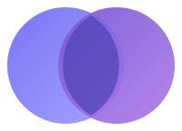

<div align="center">



# Project SAI

**관계마다 필요한 도구를 골라, 가구와 연결하는 공유 공간 서비스**

[](https://openjdk.org/projects/jdk/21/)
[](https://spring.io/projects/spring-boot)
[](https://vuejs.org/)
[](https://www.postgresql.org/)
[](LICENSE)

</div>

---

## 한눈에 보기

SAI는 **공간(Space)** 이라는 단위로 사람을 모으는 서비스입니다.
사용자는 자신의 공간을 만들고, 함께하고 싶은 사람에게 초대장을 보냅니다.
초대를 받은 사람이 수락하면 그 공간의 멤버가 됩니다. 공간 홈은 따뜻한 3D 방으로 표현하고, 가구에 일정·기록·할 일·정산 같은 기능을 연결합니다. 여행·모임·스터디는 공간 안의 이벤트로 만들고 필요한 도구를 선택합니다.

```text
메인 소개 ─▶ 회원가입 / 로그인 ─▶ 내 공간 ─▶ 3D 방 / 이벤트 / 도구
                                    └─ 공간 생성 · 멤버 초대 · 방 꾸미기
```

세션(`JSESSIONID`) 기반 인증을 사용하며, 공간마다 멤버에게 `OWNER` · `MANAGER` · `MEMBER` 역할이 부여됩니다.
초대는 공간 멤버만 보낼 수 있습니다. 자기 자신과 이미 참여 중인 사용자에게 보낼 수 없으며, 같은 초대자가 같은 공간의 같은 사용자에게 보낸 대기 중 초대는 서비스에서 중복 검사합니다. 역할별 초대 권한과 동시 요청의 중복 방지는 아직 보완할 부분입니다.

> 학습 목적으로 개발 중인 개인 프로젝트입니다. 인증·공간·초대는 백엔드 API를 사용하며, 공간 안의 세부 기능은 브라우저 임시 데이터로 먼저 구현했습니다.

## 구현 상태

| 영역 | 기능 | 상태 |
| --- | --- | :---: |
| 인증 | 회원가입, BCrypt 비밀번호 해싱 | ✅ |
| 인증 | 로그인 / 로그아웃, 세션 발급 | ✅ |
| 인증 | 로그인 사용자 조회 (`/api/auth/me`) | ✅ |
| 공간 | 공간 생성, 생성자 OWNER 지정 | ✅ |
| 공간 | 참여 중인 공간 목록 (역할 · 인원수 포함) | ✅ |
| 초대 | 초대 보내기, 자기 초대 · 중복 초대 차단 | ✅ |
| 초대 | 초대 수락 / 거절, 보낸 · 받은 초대 목록 | ✅ |
| 공통 | 전역 예외 처리, 일관된 에러 응답 | ✅ |
| 화면 | 로그인 · 회원가입, 가입 후 자동 로그인 | ✅ |
| 화면 | 인증 가드, 세션 만료 시 로그인 이동, 로그아웃 | ✅ |
| 화면 | 내 공간 목록, 역할·인원수 표시, 공간 생성 창 | ✅ |
| 화면 | 세로형 공간 목록, 상단 공간 전환, 기능별 메뉴 | ✅ |
| 화면 | 소개 페이지 → 로그인·회원가입 → 내 공간 | ✅ |
| 프론트 임시 데이터 | 3D 방, 8 × 8 격자 배치·90도 회전·충돌 검사 | ✅ |
| 프론트 임시 데이터 | 가구별 도구·이벤트 연결, 낮/저녁 분위기 | ✅ |
| 화면 | 주소에 공간·메뉴 유지, 생성 후 해당 공간 진입 | ✅ |
| 화면 | 숫자 사용자 ID로 초대 보내기, 전송·성공·실패 상태 | ✅ |
| 화면 | 받은 초대함 UI (수락 · 거절) | ⏳ |
| 공간 | 공간 삭제 API, 멤버 조회·역할 변경·내보내기 | ⏳ |
| 프론트 임시 데이터 | 기록 작성·편집·검색, 할 일·담당자·완료 관리, 달력 | ✅ |
| 프론트 임시 데이터 | 활동 생성·완료·보관·참여자, 공간·활동별 기능 추가 | ✅ |
| 프론트 임시 데이터 | 여행 일정·저장 장소·준비물·원화 정산·투표 | ✅ |
| 백엔드 | 가구 배치·기능 연결·활동·세부 도구의 API와 영속화 | ⏳ |

## 현재 화면에서 할 수 있는 일

- **회원가입 / 로그인:** 이름, 로그인 아이디, 이메일, 휴대폰 번호, 비밀번호로 가입합니다. 가입 후 자동 로그인하며, 비밀번호 표시·숨기기와 요청 오류 안내를 제공합니다.
- **내 공간:** 서버에서 참여 중인 공간을 조회하고 공간 ID, 제목, 내 역할, 참여 인원수를 표시합니다. 공간은 이미지·이름·인원수·역할·들어가기 버튼을 갖춘 목록으로 세로 배치합니다.
- **공간 내부:** 상단에서 공간을 전환하고 공간 홈·활동·기록·할 일·일정 등을 엽니다. 공간과 활동마다 설치한 기능만 메뉴에 표시합니다. 주소의 `space`, `event`, `view`, `record` 쿼리에 선택 위치를 유지합니다.
- **방 꾸미기:** 기본 가구를 추가하고 8 × 8 격자에 끌어 배치합니다. 90도 회전, 격자 표시, 겹침·방 밖 배치 검사, 변경 취소·저장을 제공합니다. 가구마다 설치한 공간 도구 또는 이벤트의 도구를 연결할 수 있으며 장식으로만 둘 수도 있습니다. 방 오른쪽에서 이벤트와 도구로 바로 이동합니다.
- **분위기:** 낮/저녁 조명, 원목·크림·보라색 계열의 무광 재질과 부드러운 그림자를 사용합니다. 실제 3D 가구 미리보기를 제공합니다.
- **공간 생성:** 이름의 앞뒤 공백을 제거하고 1~50자를 확인합니다. 생성 후 공간 목록을 다시 불러오고 새 공간으로 이동합니다.
- **사용자 초대:** 현재 선택한 공간과 양의 정수 사용자 ID를 서버에 전달합니다. 공간 전환 시 입력·결과를 초기화하며, 전송 중 공간 전환을 막고 브라우저 뒤로 가기로 이동한 경우 이전 결과를 다른 공간에 표시하지 않습니다. 프론트의 사용자 검색 UI는 아직 없습니다. 로그인 아이디 검색 API는 백엔드에 구현되어 있습니다.
- **요청 상태:** 공간 로딩, 생성·초대 처리 중, 성공·실패 안내를 표시합니다. 인증 만료 응답은 세션을 정리하고 로그인 화면으로 이동합니다.

초대 수락·거절과 보낸·받은 초대 조회는 **백엔드 API만 구현**되어 있으며 프론트엔드 초대함은 아직 없습니다. 역할 값은 표시하지만 멤버 관리 화면이나 역할별 초대 제한은 구현하지 않았습니다.

### 브라우저 데이터로 동작하는 세부 기능

- **기록:** 제목·본문 작성과 수정, 검색, 공간/활동 범위 필터, 수동 저장. 저장하지 않은 내용이 있으면 공간 이동·로그아웃 전에 확인합니다.
- **할 일·일정:** 담당자·마감일·완료 필터, 종일/시간 약속, 월별 달력과 오늘 이동. 공간 달력에서 활동 기간도 확인합니다.
- **활동:** 여행·모임·스터디·직접 구성 유형으로 만들고 기능을 선택합니다. 날짜 미정도 가능하며, 완료·보관·보관 해제를 제공합니다. 보관한 활동은 읽기 전용입니다.
- **여행:** 날짜별 일정과 저장 장소 연결, 주소·선택 좌표 직접 입력, 준비물 체크와 담당자, 지출과 원화 균등 분담, 참여자 잔액과 정산 제안, 투표 생성·선택 변경·마감.
- **기능 추가·참여자:** 공간/활동별 기능 설치와 활동의 체험 참여자 선택. 실제 서버 멤버와 예시 인물을 구분합니다. 지출에 사용된 참여자는 제거할 수 없습니다.
- **향후 예시:** AI 추천과 공동 편집은 설명 화면만 제공합니다. 실제 AI 호출이나 여러 사용자 동시 편집은 없습니다.

세부 데이터는 로그인 아이디·공간 ID별 `localStorage`에 저장되어 새로고침 후 유지됩니다. 다른 브라우저·기기·사용자와 공유되지 않으며, 브라우저 데이터를 지우면 없어집니다. 여러 탭 간 동기화와 서버 업로드·자동 이관은 아직 없습니다. 장소 화면은 저장 목록과 좌표 안내이며 지도 검색 API를 연결하지 않았습니다. 정산은 계산 결과로 실제 송금을 실행하지 않습니다.

반복 할 일과 Foot Print는 현재 범위에서 제외합니다. 일반 할 일과 직접 작성하는 기록은 유지합니다. 가구 외형과 연결 기능은 독립적입니다.

## 서비스 방향과 디자인 자료

지속적으로 유지하는 **Space(공간)** 안에 여행·모임 등 특정 활동인 **Event(활동)** 를 두고 필요한 기능을 선택합니다. 활동과 기능 모듈은 프론트엔드 임시 데이터로 구현했으며, 관련 서버 API는 다음 단계입니다.

| 기획 요소 | 현재 상태 |
| --- | --- |
| 활동 생성·완료·보관 | 프론트 임시 데이터로 동작 |
| 기록·할 일·일정, 선택형 기능 추가 | 프론트 임시 데이터로 동작 |
| 여행 일정·저장 장소·준비물·정산·투표 | 프론트 임시 데이터로 동작; 실제 지도 API는 예정 |
| 기록을 분석한 AI 기능 추천 | 향후 기능 예시 |
| 실시간 공동 편집 | 향후 기능 예시 |

- [현재 3D 방 인터랙티브 목업과 실행 방법](docs/mockups/room-interactive/README.md)
- [현재 3D 방 목업 검증](docs/mockups/room-interactive/verification.md)
- [3D 방 구조·저장 방식·에셋 라이선스](frontend/src/features/room/README.md)
- [서비스 기획서](docs/planning/sai-product-plan.md) — 초기 논의 기록이며 최신 구현 범위는 이 README를 기준으로 합니다.

아래 자료는 이전 디자인과 검증 기록입니다.

- [PC 낮 테마 32장과 화면별 동작](docs/mockups/v3-pc-light/README.md)
- [32장 상호작용 설명](docs/mockups/v3-pc-light/interaction-guide.md)
- [간결한 디자인과 공간 상단 탭 변경 시안](docs/mockups/v4-clean-nav/README.md)
- [세부 기능 승인 시안 14장](docs/mockups/v5-local-features/README.md)
- [세부 기능 실제 구현 화면 17장과 검증 결과](docs/mockups/v5-local-features/implementation.md)
- [임시 데이터 구조와 백엔드 연결 준비](docs/architecture/frontend-local-content.md)

현재 `room-interactive` 목업은 조작 가능한 독립 화면입니다. 실제 Vue 프론트에도 3D 방과 공간 목록을 반영했습니다. 목업의 예시 계정·데이터는 실제 로그인 계정으로 이관되지 않습니다. 이전 목업 PNG에는 예정 기능이 포함되어 있으므로 최신 제품의 구현 증거로 보지 않습니다.

[실제 프론트 화면 캡처와 검증 결과](docs/mockups/v4-clean-nav/verification.md)를 확인할 수 있습니다. 화면 데이터는 검증용 모의 API 응답이며 실제 운영 데이터가 아닙니다.

## 기술 스택

**Backend** — Java 21 · Spring Boot 4.1 · Spring Web MVC · Spring Data JPA · Spring Validation · Spring Security Crypto(BCrypt) · Flyway · PostgreSQL · Lombok · Gradle 9.5.1(Wrapper)

**Frontend** — Vue 3 · TypeScript · Vite · Vue Router · Pinia · Three.js / WebGL · GLTFLoader · SUIT · Playwright · oxlint / ESLint / Prettier

## 빠른 시작

### 사전 준비

- JDK 21
- PostgreSQL
- Node.js `^22.18.0 || >=24.12.0`

Gradle은 저장소에 포함된 Wrapper를 사용하므로 따로 설치하지 않습니다.
(Spring Boot 4.1 · Java 21과 호환되지 않는 구버전 Gradle을 직접 지정하면 빌드가 실패합니다.)

### 1. 데이터베이스

```sql
CREATE DATABASE sai;
```

접속 정보는 `backend/src/main/resources/application.properties`에 있으며,
비밀번호는 소스에 두지 않고 `DB_PASSWORD` 환경 변수로 전달합니다.

```properties
spring.datasource.url=jdbc:postgresql://localhost:5432/sai
spring.datasource.username=postgres
spring.datasource.password=${DB_PASSWORD}
```

첫 실행 시 Flyway가 `backend/src/main/resources/db/migration`의 스크립트로 테이블을 생성합니다.

### 2. 백엔드 실행 → http://localhost:8080

```bash
cd backend
export DB_PASSWORD="본인의 PostgreSQL 비밀번호"
./gradlew bootRun
```

<details>
<summary>Windows PowerShell</summary>

```powershell
cd backend
$env:DB_PASSWORD = "본인의 PostgreSQL 비밀번호"
.\gradlew.bat bootRun
```

</details>

### 3. 프론트엔드 실행 → http://localhost:5173

```bash
cd frontend
npm install
npm run dev
```

백엔드 주소는 `VITE_API_BASE_URL` 환경 변수로 바꿀 수 있으며, 기본값은 `http://localhost:8080`입니다.

### 4. 백엔드 없이 3D 목업 보기 → http://127.0.0.1:5192

저장소 루트에서 실행합니다. Python이 필요합니다.

```bash
python -m http.server 5192 --bind 127.0.0.1 --directory docs/mockups/room-interactive
```

목업은 예시 공간·이벤트·가구를 사용하며 실제 로그인·초대 요청을 보내지 않습니다. ES 모듈을 사용하므로 파일을 더블 클릭하지 말고 HTTP 서버로 엽니다. 실제 API를 사용하는 Vue 화면은 현재 백엔드 CORS 설정에 맞춰 `http://localhost:5173`으로 접속합니다.

### 데이터 저장 범위

| 데이터 | 저장 위치 | 공유 범위 |
| --- | --- | --- |
| 계정·공간·멤버·초대 | 백엔드 / PostgreSQL | 서버 계정·권한 기준 |
| 가구 배치·회전·도구 연결 | localStorage `sai:room:v1:<encoded-loginId>:<spaceId>` | 해당 계정·브라우저·공간 |
| 낮/저녁 설정 | localStorage `sai:room-time:<encoded-loginId>` | 해당 계정·브라우저 |
| 이벤트·세부 도구 | 프론트 콘텐츠 저장소 / localStorage | 해당 계정·브라우저·공간 |
| 독립 목업 | localStorage `sai-room-mock`, `sai-cottage-time` | 목업을 연 브라우저 |

가구와 세부 도구는 아직 서버에 저장되지 않습니다. 다른 멤버·기기와 공유하려면 서버 저장·권한 검증·동기화 API가 필요합니다. WebGL 지원 브라우저가 필요하며 실제 모바일 GPU 성능은 검증하지 않았습니다.

## API

모든 응답은 JSON이며, 로그인 이후 요청에는 `JSESSIONID` 쿠키가 필요합니다.

### 인증 `/api/auth`

| Method | Path | 설명 |
| --- | --- | --- |
| `POST` | `/signup` | 회원가입 |
| `POST` | `/login` | 로그인, 세션 생성 후 `userId` 반환 |
| `POST` | `/logout` | 로그아웃, 세션 무효화 |
| `GET` | `/me` | 현재 로그인한 사용자 정보 |

```jsonc
// POST /api/auth/signup
{
  "name": "홍길동",
  "loginId": "hong1234",
  "password": "password123!",
  "phoneNumber": "010-1234-5678",
  "email": "hong@example.com"
}
```

### 공간 `/api/spaces`

| Method | Path | 설명 |
| --- | --- | --- |
| `POST` | `/` | 공간 생성 (요청자가 `OWNER`) |
| `GET` | `/my` | 참여 중인 공간 목록 — 제목, 역할, 멤버 수 |

### 사용자 `/api/users`

| Method | Path | 설명 |
| --- | --- | --- |
| `GET` | `/search?loginId=...` | 로그인 아이디로 사용자 검색 (세션 필요; 프론트 검색 UI 미연결) |

### 초대 `/api/invitations`

| Method | Path | 설명 |
| --- | --- | --- |
| `POST` | `/` | 초대 보내기 (`spaceId`, `inviteeUserId`) |
| `POST` | `/join` | 초대 수락 → 공간 멤버로 등록 |
| `POST` | `/deny` | 초대 거절 |
| `GET` | `/received` | 내가 받은 초대 목록 |
| `GET` | `/sent` | 내가 보낸 초대 목록 |

## 데이터 모델

```text
users ──< space_member >── space
  │                          │
  └──< space_invitation >────┘
        inviter / invitee, status: PENDING · ACCEPTED · DENIED
```

| 테이블 | 설명 |
| --- | --- |
| `users` | 사용자 계정. `login_id` 유니크, 비밀번호는 해시로만 저장 |
| `space` | 공간 |
| `space_member` | 공간 참여 정보. `(user_id, space_id)` 유니크, `role` 보유 |
| `space_invitation` | 초대장. 초대자 · 피초대자 · 상태 |

자세한 관계는 [`docs/database/ERD.puml`](docs/database/ERD.puml)을 참고하세요.

## 프로젝트 구조

```text
project-sai
├── backend                      Spring Boot 백엔드
│   └── src
│       ├── main/java/com/sai/backend
│       │   ├── auth             회원가입 · 로그인 · 세션
│       │   ├── space            공간 · 멤버 · 초대
│       │   ├── user             사용자 엔티티와 Repository
│       │   ├── common           설정과 세션 상수
│       │   └── global           전역 예외 처리
│       ├── main/resources
│       │   ├── application.properties
│       │   └── db/migration     Flyway 마이그레이션
│       └── test                 Service · Controller · Repository 테스트
├── frontend                     Vue 3 프론트엔드
│   └── src
│       ├── views                소개 · 로그인 · 회원가입 · 내 공간
│       ├── components           AppLogo, AuthLayout
│       ├── stores               Pinia (auth, spaces)
│       ├── services             API 클라이언트
│       ├── features/content     세부 기능 화면·모델·저장소·검증 계산
│       ├── features/room        3D 방 · 배치 모델 · 렌더러 · 라이선스
│       ├── styles/cottage.css    따뜻한 공간 디자인
│       └── router               라우팅과 인증 가드
└── docs
    ├── architecture             기술 스택 문서
    ├── database                 ERD
    ├── devlog                   개발 기록
    └── mockups                  디자인 시안·PNG·상호작용 설명 (예정 기능 포함)
```

## 테스트

```bash
# 백엔드 — 실제 PostgreSQL 연결이 필요합니다
cd backend
export DB_PASSWORD="본인의 PostgreSQL 비밀번호"
./gradlew test

# 프론트엔드
cd frontend
npm run build # 타입 검사와 프로덕션 빌드
npm run test:unit # 정산·날짜·저장소·배치·충돌 검사
npm run test:e2e
```

프론트엔드 E2E 테스트에는 모의 API 응답을 사용하는 화면·요청 계약 검사가 포함되어 있습니다. 통과하더라도 실제 PostgreSQL과 백엔드가 연결된 전체 흐름의 검증을 대신하지 않습니다.

3D를 포함한 Chromium 검사는 별도 터미널에서 Vite를 켠 후 실행합니다.

```bash
# 터미널 1 — frontend 디렉터리
npm run dev -- --host 127.0.0.1 --port 5193

# 터미널 2 — frontend 디렉터리
npx playwright test --config playwright.cottage.config.ts
```

2026-10-06 구현 검증: 타입 검사·빌드, 단위 검사 18개, Chromium 화면·요청 계약·3D 테스트를 확인했습니다. 드래그, 경계·충돌 검사, 회전 저장·새로고침, 취소, 공간별 분리, 가구→이벤트 도구 이동, 모바일 폭 배치를 검사합니다. 백엔드는 이 프론트 변경에서 수정하지 않았으며 실제 DB 통합 검사와 모바일 GPU 검사는 실행하지 않았습니다. 3D 엔진은 공간 진입 시 지연 로딩하며 빌드에서 번들 크기 경고가 발생합니다.

## 문서

- [기술 스택](docs/architecture/stack.md)
- [ERD](docs/database/ERD.puml)
- [개발 기록](docs/devlog)
- [2026-10-06 · 3D 공간과 승인 로고 적용](docs/devlog/261006.md)

## 라이선스

프로젝트 코드는 [MIT](LICENSE)입니다. Three.js는 MIT, [Kenney Furniture Kit](https://kenney.nl/assets/furniture-kit)의 가구 모델은 CC0이며 사용 파일 옆에 라이선스를 포함합니다. Virtual Cottage 2는 분위기 참고이며 해당 게임의 에셋은 사용하지 않습니다.
