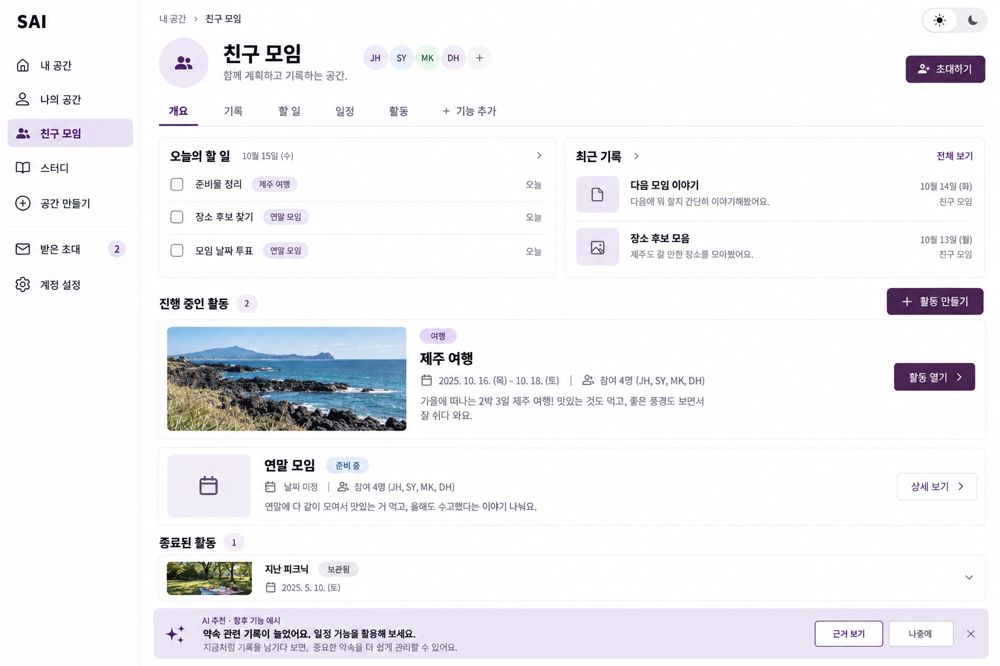
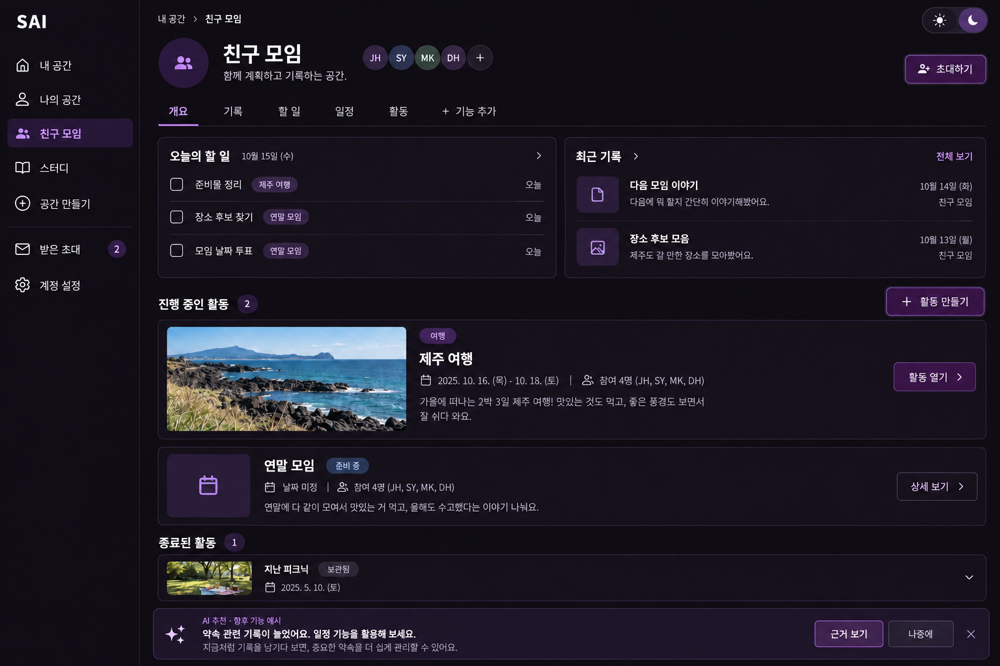
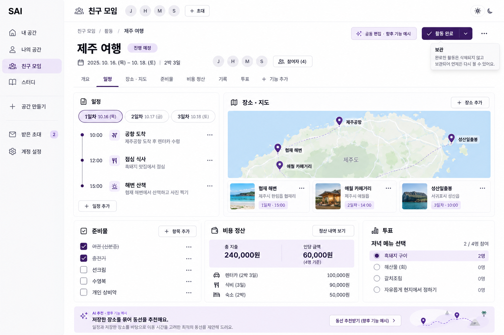
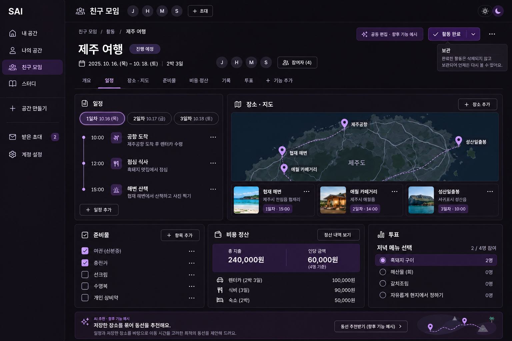
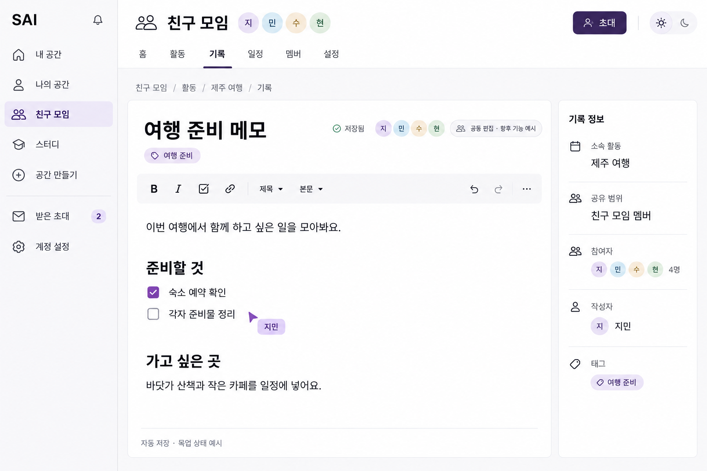
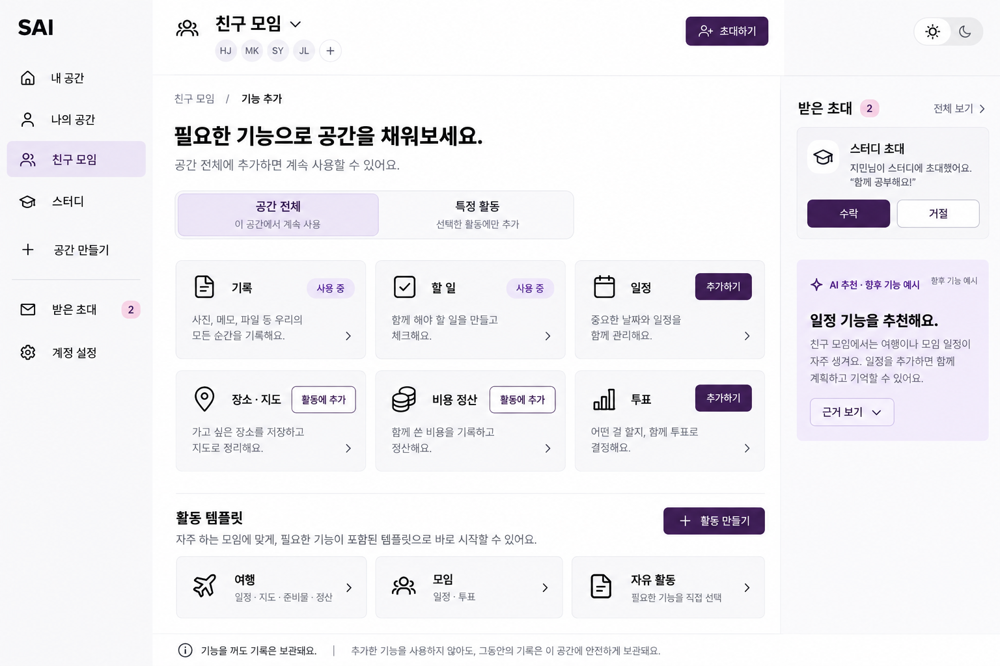
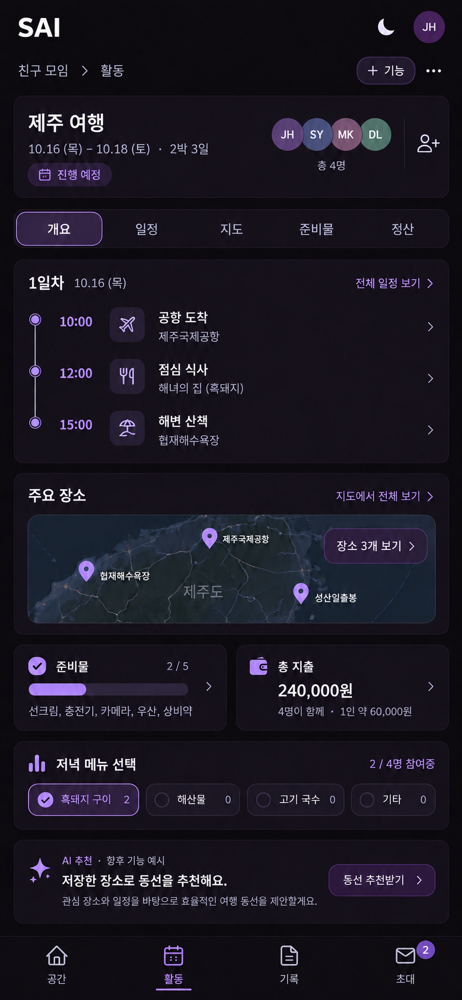

# SAI 프론트 목업 v2 — Space / Event
2026-10-05 · 승인 자료 · 제품 구현 화면이 아닌 PNG 디자인 제안입니다.

## 방향
Space는 지속되는 기반이고, Event는 그 안에서 특정 활동을 진행하는 단위입니다.
사용자 화면에서 Event는 ‘활동’이라고 부릅니다. 캘린더의 개별 일정과 구분합니다.
개인 Space에서도 혼자 가는 여행이나 시험 준비 활동을 만들 수 있습니다.
평소 기록과 할 일은 Space에 바로 넣고, 특정 활동에 속한 콘텐츠에는 해당 활동 이름을 표시합니다.

## 화면 7장
| 화면 | 낮 | 밤 |
|---|---|---|
| Space 개요 | [PNG](space-light.png) | [PNG](space-dark.png) |
| 여행 Event | [PNG](event-light.png) | [PNG](event-dark.png) |
| 기록 상세·편집 | [PNG](record-light.png) | 동일 테마 토큰 적용 예정 |
| 기능 선택 | [PNG](features-light.png) | 동일 테마 토큰 적용 예정 |
| 모바일 여행 Event | 동일 테마 토큰 적용 예정 | [PNG](mobile-dark.png) |

### Space — 낮

### Space — 밤

### 여행 Event — 낮

### 여행 Event — 밤

### 기록 상세·편집

### 기능 선택

### 모바일 여행 Event

## 기능 반영 범위
| 기능 | 화면 / 동작 제안 |
|---|---|
| 개인·모임 Space | 좌측 공간 목록과 전환, 공간 생성 |
| 초대·참여 | 초대 버튼, 받은 초대 수락·거절, 멤버·참여자 표시 |
| 공통 기록 | Space와 활동 각각에 작성, 제목·본문·태그·저장 상태 |
| 할 일 | 평소 할 일과 활동 준비물을 구분, 완료 체크 |
| 일정 | Space의 약속과 Event의 날짜별 일정 |
| Event 생성 | 여행 / 모임 / 자유 활동 템플릿, 날짜 미정 허용 |
| 여행 기능 | 장소 저장, 지도, 날짜별 동선, 준비물, 비용 정산 |
| 투표 | 날짜·장소·메뉴 등 선택 |
| 기능 추가 | 공간 전체 / 특정 활동 범위 선택 |
| AI 추천 | 기록 기반 기능 추천 및 근거 보기; 여행 동선 추천은 별도 향후 예시 |
| 공동 편집 | 참여자와 커서 표시; 향후 기능 예시 |
| 완료·보관 | Event 완료 후 보관, 과거 기록 유지 |
| 테마·모바일 | 낮 / 밤 전환, 좁은 화면에서 세로 구성 |

AI·실시간 협업·지도·정산은 실제 연동이 아닌 디자인 예시입니다.
로그인·회원가입의 기존 기능은 유지하며, 새 테마 적용 시 별도 화면·상태 자료로 확인합니다.
‘여행 템플릿’은 여러 기능의 초기 구성을 도와줍니다. Trip 저장소를 아직 분석하지 않았으므로 실제 코드 재사용을 확정한 것은 아닙니다.
지도는 생성된 예시 이미지이며 정확한 위치·경로·이동 시간 자료가 아닙니다.
인당 60,000원은 240,000원을 4명에게 균등 배분한 예시입니다. 실제 정산은 결제자·부담자·기지급액을 함께 계산해야 합니다.

## 낮·밤 디자인 토큰
| 의미 | 낮 | 밤 |
|---|---|---|
| 배경 | #FFFFFF | #0D0B10 |
| 카드 | #F7F6F9 | #18131E |
| 기본 글자 | #141217 | #F5F2F7 |
| 보조 글자 | #625B6C | #BEB6C8 |
| 주 행동 버튼 | #39204F + 흰 글자 | #39204F + 흰 글자 + 보라 테두리 |
| 선택 배경 | #ECE5F3 | #291A39 |
| 선택 글자·아이콘 | #39204F | #CBB4E8 |
| 구분선 | #E5E0E9 | #33293F |
| 포커스 | #6E4B91 | #B79BD8 |

낮은 흰색·검정·어두운 보라, 밤은 검정·흰색·어두운 보라를 기본으로 합니다.
밤에는 어두운 보라만으로 선택 상태를 표시하면 구분하기 어려워 밝은 보라를 글자·테두리에 보조 사용합니다.
여행 사진과 지도는 고유 색을 유지하고, 앱 조작 요소를 공통 색으로 통일합니다.
오류·주의·성공은 문구와 아이콘을 함께 사용하며 필요한 의미 색을 별도로 둡니다.
서체는 Pretendard / 시스템 한글 대체, 본문 16px, 보조 14px, 제목 24–32px.
간격 4/8/12/16/24/32px, 카드 모서리 12–16px, 모바일 조작 영역 최소 44px.
PNG는 시각적 제안이며 구현에서 토큰·아이콘·탭 순서를 아래 기준으로 통일합니다.

## 탐색·범위 기준
- Space 기본 탐색: 개요 / 기록 / 할 일 / 일정 / 활동 / 기능 추가. 실제 추가한 기능만 표시합니다.
- Event 탐색: 개요 및 해당 활동에 설치한 기능. 여행 예시는 일정 / 장소·지도 / 준비물 / 비용 정산 / 기록 / 투표.
- 항상 ‘Space > 활동 > Event’ 경로로 소속을 확인할 수 있습니다.
- 기능 선택 화면의 일정 ‘추가하기’는 설치 전 상태 예시입니다. 개요의 일정 탭은 설치 후 상태 예시이며, 구현에서는 설치 상태를 단일 기준으로 일치시킵니다.
- 공간 전체와 특정 활동은 기능 설치 범위입니다. 첫 카탈로그 예시의 여행 기능은 활동에 추가하도록 유도하되, 모든 기능의 배치 가능 범위를 하드코딩하기 전 별도 설계로 확정합니다.
- Event 참여자 선택은 열람 권한과 다릅니다. 첫 제안은 Space 멤버가 열람 가능하고, Event 참여자를 별도로 지정하는 방식입니다. 비공개 Event나 외부 초대는 별도 승인 범위입니다.
- Space의 OWNER / MANAGER / MEMBER 역할에 따라 생성·설정·초대 가능 여부를 표시합니다. 서버 권한 검증은 백엔드 설계가 필요합니다.
- Event 상태는 준비 / 진행 / 완료 / 보관. 종료일 경과만으로 삭제하지 않고 완료·보관을 제안합니다.
- 완료와 보관은 구분합니다. 완료는 활동 종료, 보관은 목록에서 접고 과거 기록으로 남기는 동작입니다.
- 영구 삭제와 콘텐츠 보존·수정 가능 정책은 실제 기능 구현 전 확정합니다.

## 주요 흐름과 예외 상태
1. Space 생성 또는 선택 → 초대 → 수락·거절 → 내부 콘텐츠 사용.
2. 활동 만들기 → 여행·모임·자유 선택 → 제목·선택적 기간·참여자·기능 확인 → 활동 생성.
3. 활동 진입 → 일정·장소·준비물·정산·투표·기록 관리 → 완료 → 보관 → 재열람.
4. 기능 추가 → 공간 전체 또는 특정 활동 선택 → 미사용/사용 중 확인 → 추가 → 선택한 범위에만 반영.
5. AI 추천 근거 열람 또는 나중에 숨기기. 자동으로 기능 설치·기록 변경하지 않습니다.

구현 시 함께 보여줄 상태: 로딩, 빈 공간·빈 활동, 오류·재시도, 읽기 전용, 저장 중·저장 실패, 미저장 이동, 초대 중복·권한 없음, 지도 로딩 실패, 투표 마감, 정산 미입력, 완료·보관 상태.
이번 PNG는 주요 정상 상태이며 위 예외 상태를 모두 그린 자료는 아닙니다.

## 구현 후 검증 계획
| 검증 | 통과 기준 | 증거 |
|---|---|---|
| 테마 전환 | 모든 화면과 팝업에 적용, 글자·초점 구분 | 낮·밤 실제 화면 캡처 |
| 화면 폭 390/768/1440px | 가로 넘침·핵심 조작 겹침 없음 | 폭별 캡처 |
| 기능 설치 범위 | Space 설치와 Event 설치가 섞이지 않음 | 각각 설치·제거 시나리오 |
| 기록 소속 | Space와 Event 간 목록·경로 정확 | 두 위치 작성·조회 시나리오 |
| 활동 종료 | 완료·보관 후에도 기록 재열람 | 상태 전환 확인 |
| 초대·권한 | 수락·거절과 역할별 조작 일치 | API 연동 시 역할별 검사 |
| 정산 | 예시 240,000 / 4 = 60,000, 실제 잔액은 결제·부담 차이 반영 | 승인된 계산 규칙의 사례 검사 |
| 접근성 | 키보드 핵심 작업, 일반 글자 대비 4.5:1 목표 | 초점·대비 측정 |
| 향후 기능 표시 | AI·협업 예시를 실제 기능으로 오해하지 않도록 표시 | 화면 문구 확인 |

위 항목은 검증 계획입니다. 제품 프론트 코드를 바꾸거나 이 검증을 제품에 실행하지 않았습니다.
PNG 7장을 열어 구조·표시 상태·읽기 쉬움을 시각 검토했습니다. 날짜·인물·여행 비용은 가상 자료입니다.

## 승인 단계와 생성 기록
현재 완료 범위는 목업과 검토 문서입니다. 등록한 전역 구현 전 승인 규칙에 따라 제품 구현 전 이 자료의 범위에 대한 명시적 승인이 필요합니다.
전체 시안 승인은 디자인 방향 승인입니다. AI·공동 편집·정산·지도 등 실제 기술 연동은 해당 설계와 실험 계획을 추가 제시합니다.
내장 image_gen.imagegen을 사용했습니다. [전체 생성·보정 프롬프트](prompts.json)를 제공합니다.
