# SAI PC 낮 테마 — 32개 화면과 동작 설명

2026-10-05 · 정적 화면 승인 자료. 제품 코드는 변경하지 않았습니다. AI 추천과 실시간 공동 편집은 31·32번 향후 예시로 포함합니다.

## 이번 시안에서 단순하게 만든 점

- 지속되는 공간과 특정 활동을 왼쪽 탐색에서 구분합니다. 활동 안에는 해당 활동의 기능만 표시합니다.
- UI 명칭은 공간 / 활동 / 일정으로 통일합니다. Event는 활동이고, 일정은 날짜·시간이 있는 개별 항목입니다.
- 계정 설정, 테마 전환, 프로필 편집, 소셜 로그인, 결제·송금, 자동 저장, 파일 첨부, 권한 변경 UI는 제외합니다.
- 기록은 일반 텍스트와 명시적 저장부터 시작합니다. 지도·정산은 요구된 여행 기능 설계에 포함하되 실제 API 연동 완료를 의미하지 않습니다.
- 모든 날짜·이름·금액·사용자 ID는 예시입니다. 지도는 지리 정보가 아닌 배치 목업입니다.
- 각 PNG 오른쪽 설명 영역은 검토용입니다. 실제 제품 화면에는 포함하지 않습니다.

## 공통 요소

| 요소 | 동작 |
|---|---|
| 내 공간 | 03 공간 목록으로 이동 |
| 받은 초대 | 08 수락 대기 초대 확인 |
| 친구 모임 | 06 공간 홈 이동 |
| 공간 안의 메뉴 | 해당 공간 데이터로 이동. 설치한 기능만 표시 |
| 활동 안의 메뉴 | 제주 여행 등 현재 활동 데이터로 이동 |
| 공간으로 | 활동을 닫고 상위 공간 홈 이동 |
| 로그인 이름·아바타 | 읽기 전용 표시. 계정 설정으로 연결하지 않음 |
| 로그아웃 | 미저장 내용이 있으면 이동 확인 후 세션 종료, 01 이동 |
| 버튼 번호 | 검토 문서와 연결하는 표식, 제품에서는 제거 |
| 화면 제목·안내·배지 | 현재 위치와 상태를 알려주는 읽기 전용 요소 |
| 입력란 | 직접 입력. 필수값·형식 검증 후 오류를 해당 필드에 표시 |
| 체크박스·선택상자 | 각 화면 설명의 범위 내에서 선택 상태 변경 |

## 화면별 모든 조작 설명

### 01. 로그인

내 공간으로 들어가는 첫 화면

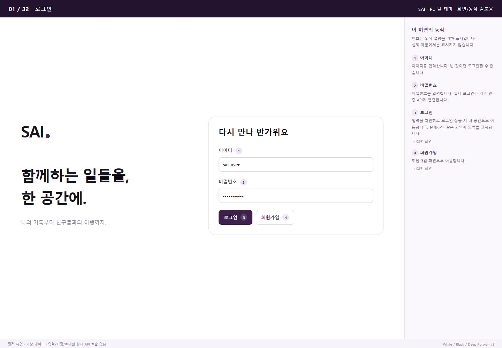

| 번호 | 요소 | 동작·결과 | 이동 |
|---|---|---|---|
| 1 | 아이디 | 아이디를 입력합니다. 빈 값이면 로그인할 수 없습니다. | 현재 화면 |
| 2 | 비밀번호 | 비밀번호를 입력합니다. 실제 로그인은 기존 인증 API에 연결합니다. | 현재 화면 |
| 3 | 로그인 | 입력을 확인하고 로그인 성공 시 내 공간으로 이동합니다. 실패하면 같은 화면에 오류를 표시합니다. | 03 |
| 4 | 회원가입 | 회원가입 화면으로 이동합니다. | 02 |

**상태·예외:** 실패: “아이디 또는 비밀번호를 확인해 주세요.” 제출 중 버튼 중복 클릭 방지. 소셜 로그인·비밀번호 재설정은 이번 범위에서 제외.

### 02. 회원가입

필요한 정보를 입력하고 계정 만들기

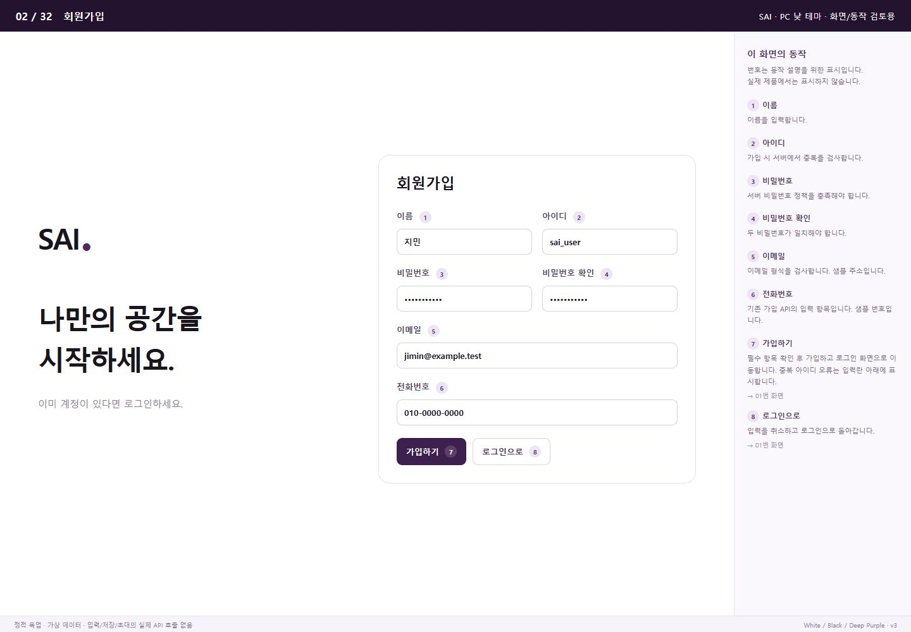

| 번호 | 요소 | 동작·결과 | 이동 |
|---|---|---|---|
| 1 | 이름 | 이름을 입력합니다. | 현재 화면 |
| 2 | 아이디 | 가입 시 서버에서 중복을 검사합니다. | 현재 화면 |
| 3 | 비밀번호 | 서버 비밀번호 정책을 충족해야 합니다. | 현재 화면 |
| 4 | 비밀번호 확인 | 두 비밀번호가 일치해야 합니다. | 현재 화면 |
| 5 | 이메일 | 이메일 형식을 검사합니다. 샘플 주소입니다. | 현재 화면 |
| 6 | 전화번호 | 기존 가입 API의 입력 항목입니다. 샘플 번호입니다. | 현재 화면 |
| 7 | 가입하기 | 필수 항목 확인 후 가입하고 로그인 화면으로 이동합니다. 중복 아이디 오류는 입력란 아래에 표시합니다. | 01 |
| 8 | 로그인으로 | 입력을 취소하고 로그인으로 돌아갑니다. | 01 |

**상태·예외:** 가입 요건은 기존 API와 대조해 확정합니다. 약관·인증·비밀번호 정책을 이미 구현됐다고 가정하지 않습니다.

### 03. 내 공간

개인 공간과 함께 사용하는 공간을 한눈에

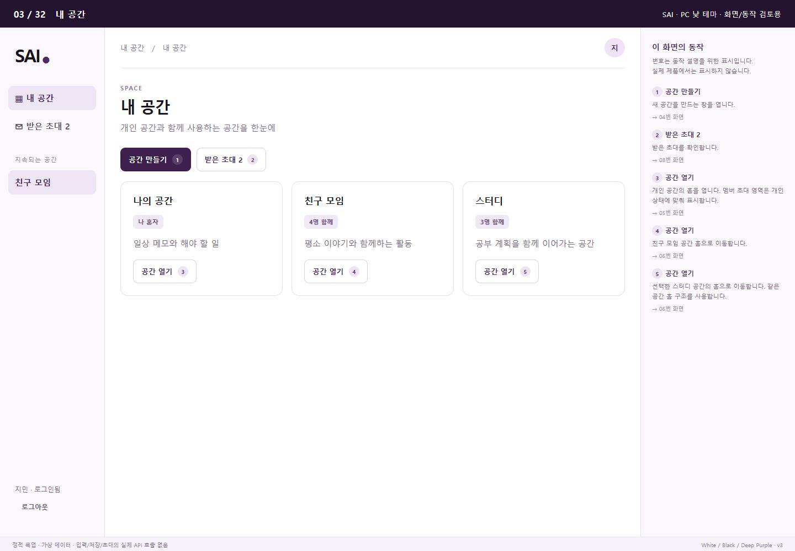

| 번호 | 요소 | 동작·결과 | 이동 |
|---|---|---|---|
| 1 | 공간 만들기 | 새 공간을 만드는 창을 엽니다. | 04 |
| 2 | 받은 초대 2 | 받은 초대를 확인합니다. | 08 |
| 3 | 공간 열기 | 개인 공간의 홈을 엽니다. 멤버 초대 영역은 개인 상태에 맞춰 표시합니다. | 05 |
| 4 | 공간 열기 | 친구 모임 공간 홈으로 이동합니다. | 06 |
| 5 | 공간 열기 | 선택한 스터디 공간의 홈으로 이동합니다. 같은 공간 홈 구조를 사용합니다. | 06 |

**상태·예외:** 로딩 → 성공 또는 오류 안내. 오류가 나면 입력을 유지하고 다시 시도합니다.

### 04. 공간 만들기

계속 사용할 공간의 이름을 정하기

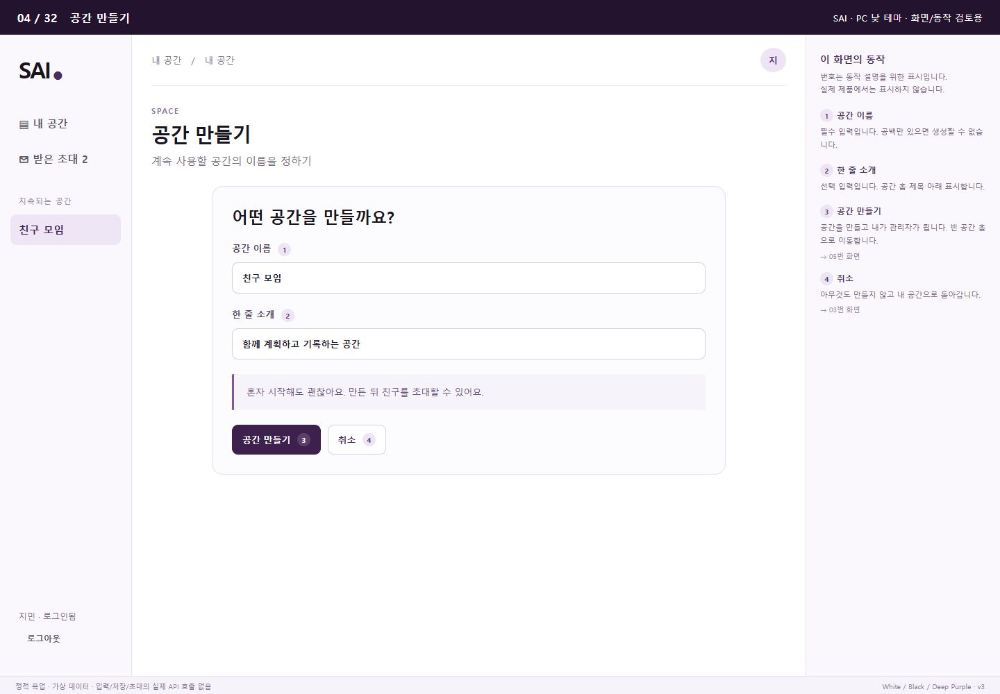

| 번호 | 요소 | 동작·결과 | 이동 |
|---|---|---|---|
| 1 | 공간 이름 | 필수 입력입니다. 공백만 있으면 생성할 수 없습니다. | 현재 화면 |
| 2 | 한 줄 소개 | 선택 입력입니다. 공간 홈 제목 아래 표시합니다. | 현재 화면 |
| 3 | 공간 만들기 | 공간을 만들고 내가 관리자가 됩니다. 빈 공간 홈으로 이동합니다. | 05 |
| 4 | 취소 | 아무것도 만들지 않고 내 공간으로 돌아갑니다. | 03 |

**상태·예외:** 만드는 중 중복 제출을 막습니다. 실패해도 이름·소개 입력은 유지합니다.

### 05. 처음 만든 공간

빈 화면에서도 다음 행동을 바로 알기

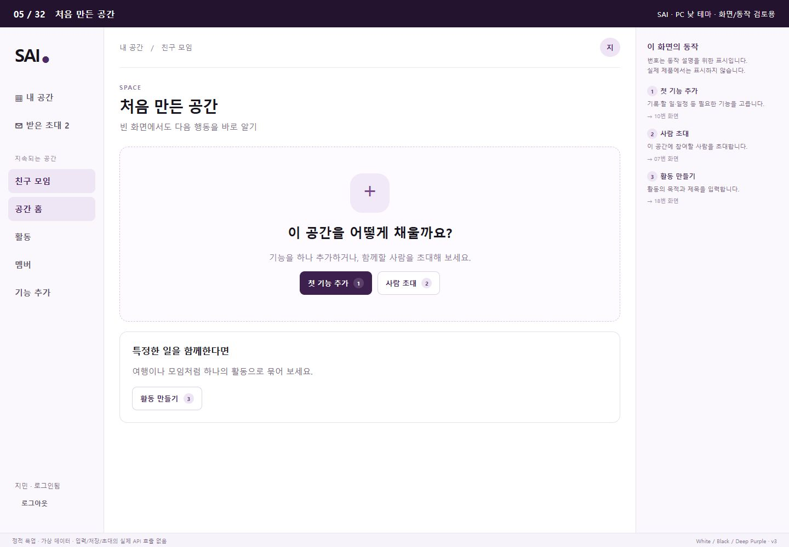

| 번호 | 요소 | 동작·결과 | 이동 |
|---|---|---|---|
| 1 | 첫 기능 추가 | 기록·할 일·일정 등 필요한 기능을 고릅니다. | 10 |
| 2 | 사람 초대 | 이 공간에 참여할 사람을 초대합니다. | 07 |
| 3 | 활동 만들기 | 활동의 목적과 제목을 입력합니다. | 18 |

**상태·예외:** 기록이나 숫자를 임의로 채우지 않습니다. 개인 공간도 같은 빈 상태를 사용합니다.

### 06. 공간 홈

평소 콘텐츠와 활동을 명확히 구분하기

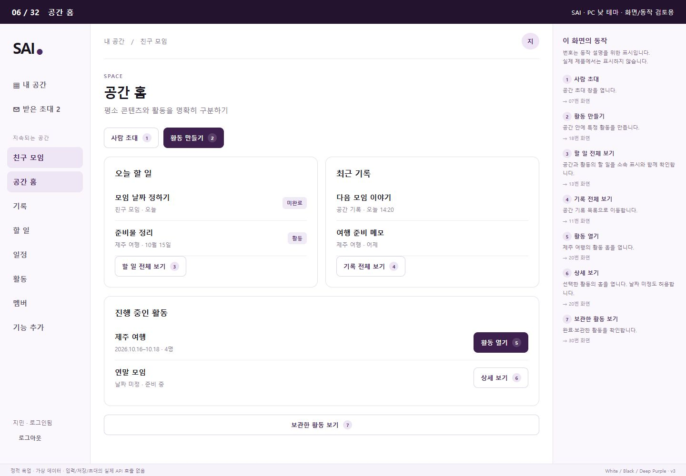

| 번호 | 요소 | 동작·결과 | 이동 |
|---|---|---|---|
| 1 | 사람 초대 | 공간 초대 창을 엽니다. | 07 |
| 2 | 활동 만들기 | 공간 안에 특정 활동을 만듭니다. | 18 |
| 3 | 할 일 전체 보기 | 공간과 활동의 할 일을 소속 표시와 함께 확인합니다. | 13 |
| 4 | 기록 전체 보기 | 공간 기록 목록으로 이동합니다. | 11 |
| 5 | 활동 열기 | 제주 여행의 활동 홈을 엽니다. | 20 |
| 6 | 상세 보기 | 선택한 활동의 홈을 엽니다. 날짜 미정도 허용합니다. | 20 |
| 7 | 보관한 활동 보기 | 완료·보관한 활동을 확인합니다. | 30 |

**상태·예외:** 로딩 → 성공 또는 오류 안내. 오류가 나면 입력을 유지하고 다시 시도합니다.

### 07. 사람 초대

누구를 어느 공간에 초대하는지 확인하기

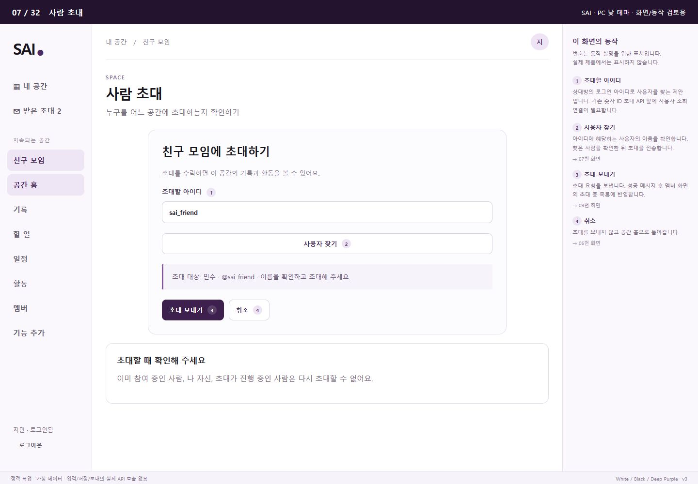

| 번호 | 요소 | 동작·결과 | 이동 |
|---|---|---|---|
| 1 | 초대할 아이디 | 상대방의 로그인 아이디로 사용자를 찾는 제안입니다. 기존 숫자 ID 초대 API 앞에 사용자 조회 연결이 필요합니다. | 현재 화면 |
| 2 | 사용자 찾기 | 아이디에 해당하는 사용자의 이름을 확인합니다. 찾은 사람을 확인한 뒤 초대를 전송합니다. | 07 |
| 3 | 초대 보내기 | 초대 요청을 보냅니다. 성공 메시지 후 멤버 화면의 초대 중 목록에 반영합니다. | 09 |
| 4 | 취소 | 초대를 보내지 않고 공간 홈으로 돌아갑니다. | 06 |

**상태·예외:** 대상을 찾을 수 없음 / 이미 초대함 / 권한 없음 / 전송 실패를 각각 안내합니다. 실제 초대 전송이 일어나는 목업은 아닙니다.

### 08. 받은 초대

수락과 거절의 결과를 바로 이해하기

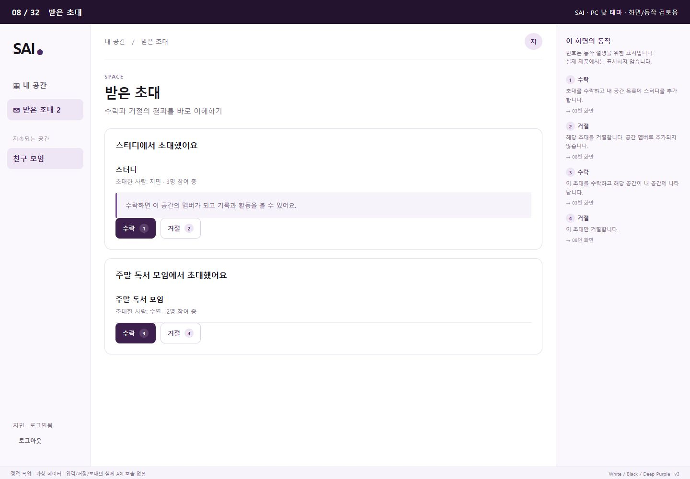

| 번호 | 요소 | 동작·결과 | 이동 |
|---|---|---|---|
| 1 | 수락 | 초대를 수락하고 내 공간 목록에 스터디를 추가합니다. | 03 |
| 2 | 거절 | 해당 초대를 거절합니다. 공간 멤버로 추가되지 않습니다. | 08 |
| 3 | 수락 | 이 초대를 수락하고 해당 공간이 내 공간에 나타납니다. | 03 |
| 4 | 거절 | 이 초대만 거절합니다. | 08 |

**상태·예외:** 초대 없음 / 이미 처리됨 / 만료·취소됨 / 처리 실패. 같은 초대를 두 번 처리하지 않습니다.

### 09. 함께하는 사람

현재 멤버와 수락 대기 중인 초대를 구분하기

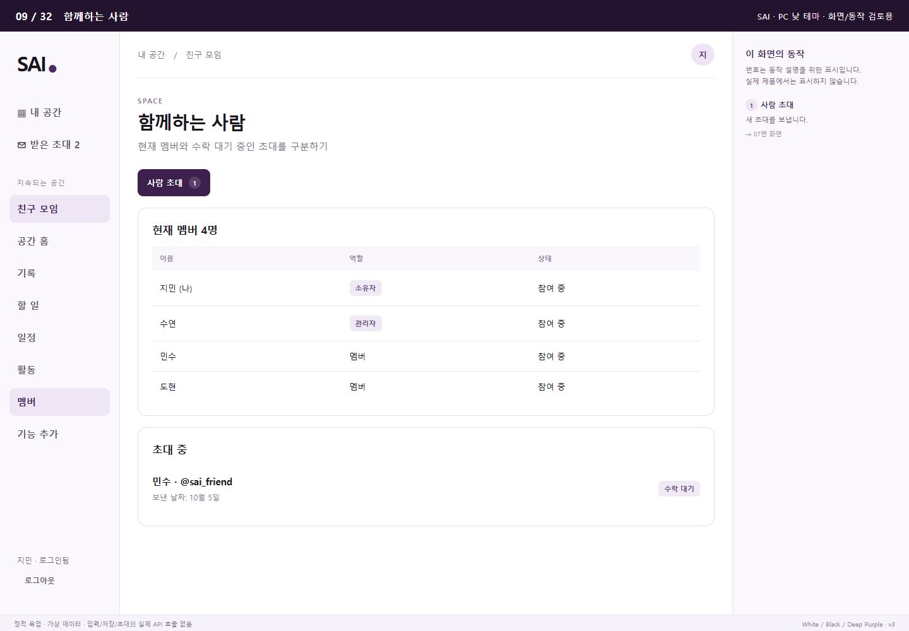

| 번호 | 요소 | 동작·결과 | 이동 |
|---|---|---|---|
| 1 | 사람 초대 | 새 초대를 보냅니다. | 07 |

**상태·예외:** 역할은 읽기 전용입니다. 역할 변경·강제 퇴장·소유권 이전은 이번 범위에서 제외합니다.

### 10. 기능 추가

어디에 추가할지 먼저 선택하기

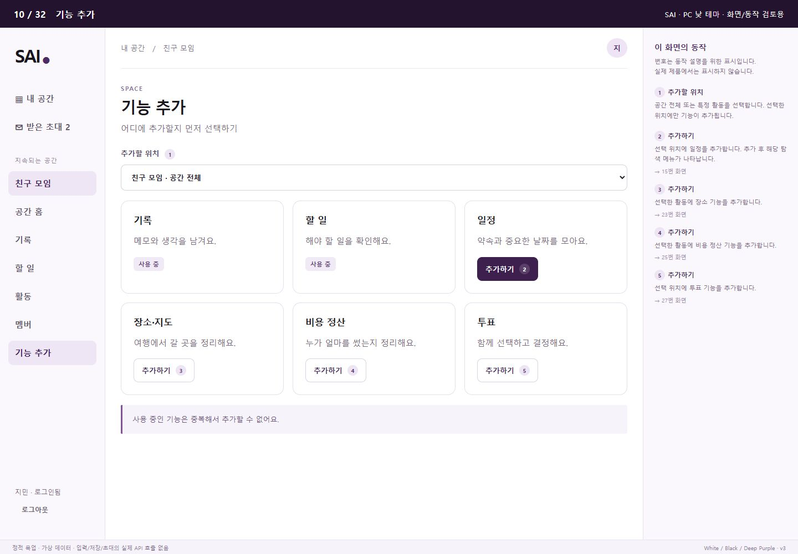

| 번호 | 요소 | 동작·결과 | 이동 |
|---|---|---|---|
| 1 | 추가할 위치 | 공간 전체 또는 특정 활동을 선택합니다. 선택한 위치에만 기능이 추가됩니다. | 현재 화면 |
| 2 | 추가하기 | 선택 위치에 일정을 추가합니다. 추가 후 해당 탐색 메뉴가 나타납니다. | 15 |
| 3 | 추가하기 | 선택한 활동에 장소 기능을 추가합니다. | 23 |
| 4 | 추가하기 | 선택한 활동에 비용 정산 기능을 추가합니다. | 25 |
| 5 | 추가하기 | 선택 위치에 투표 기능을 추가합니다. | 27 |

**상태·예외:** 설치 전 상태 예시입니다. 다른 화면의 일정 탭은 설치 후 상태입니다. 메뉴와 설치 상태는 실제 구현에서 함께 갱신됩니다. 기능 제거는 이번 범위 제외.

### 11. 기록 목록

필요한 기록을 찾아 열기

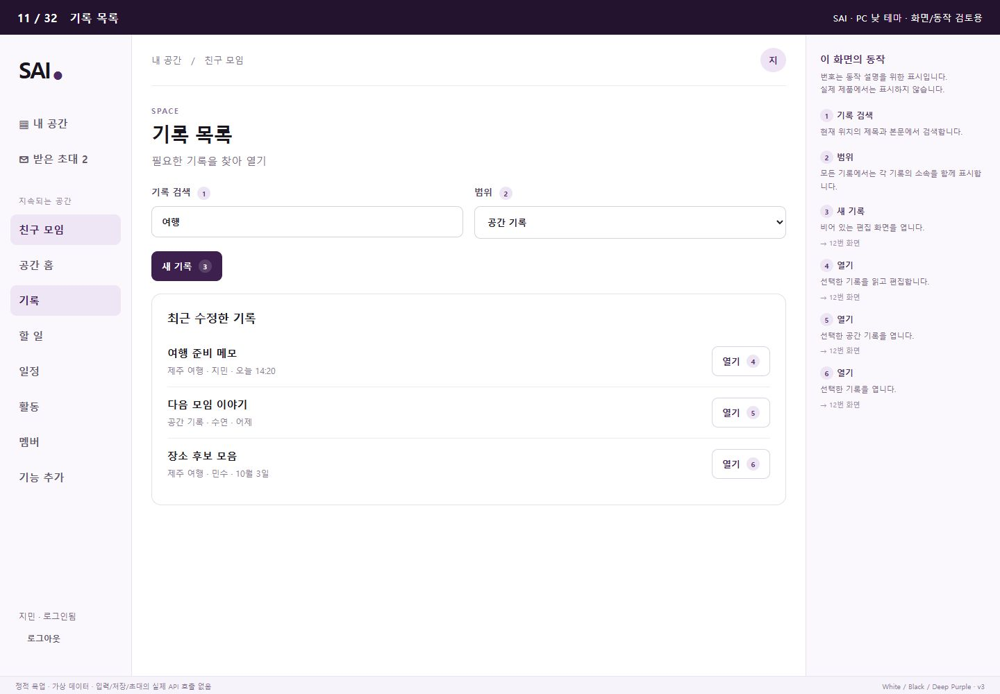

| 번호 | 요소 | 동작·결과 | 이동 |
|---|---|---|---|
| 1 | 기록 검색 | 현재 위치의 제목과 본문에서 검색합니다. | 현재 화면 |
| 2 | 범위 | 모든 기록에서는 각 기록의 소속을 함께 표시합니다. | 현재 화면 |
| 3 | 새 기록 | 비어 있는 편집 화면을 엽니다. | 12 |
| 4 | 열기 | 선택한 기록을 읽고 편집합니다. | 12 |
| 5 | 열기 | 선택한 공간 기록을 엽니다. | 12 |
| 6 | 열기 | 선택한 기록을 엽니다. | 12 |

**상태·예외:** 검색 결과 없음 / 아직 기록 없음 / 읽기 실패. 공간·활동 이름은 데이터 소속에 따라 표시합니다.

### 12. 기록 작성·편집

자동 저장 대신 명시적인 저장으로 단순하게

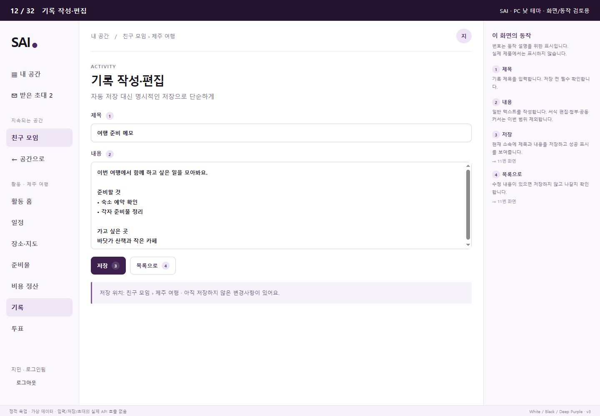

| 번호 | 요소 | 동작·결과 | 이동 |
|---|---|---|---|
| 1 | 제목 | 기록 제목을 입력합니다. 저장 전 필수 확인합니다. | 현재 화면 |
| 2 | 내용 | 일반 텍스트를 작성합니다. 서식 편집·첨부·공동 커서는 이번 범위 제외합니다. | 현재 화면 |
| 3 | 저장 | 현재 소속에 제목과 내용을 저장하고 성공 표시를 보여줍니다. | 11 |
| 4 | 목록으로 | 수정 내용이 있으면 저장하지 않고 나갈지 확인합니다. | 11 |

**상태·예외:** 저장 중 버튼 비활성 / 성공 시 목록 갱신 / 실패 시 29번. 저장되지 않은 입력을 유지합니다.

### 13. 할 일 목록

완료 여부·담당자·소속을 한 줄에서 보기

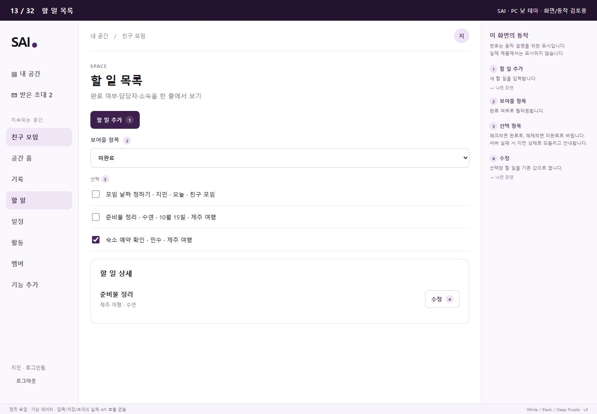

| 번호 | 요소 | 동작·결과 | 이동 |
|---|---|---|---|
| 1 | 할 일 추가 | 새 할 일을 입력합니다. | 14 |
| 2 | 보여줄 항목 | 완료 여부로 필터링합니다. | 현재 화면 |
| 3 | 선택 항목 | 체크하면 완료로, 해제하면 미완료로 바뀝니다. 서버 실패 시 이전 상태로 되돌리고 안내합니다. | 현재 화면 |
| 4 | 수정 | 선택한 할 일을 기존 값으로 엽니다. | 14 |

**상태·예외:** 빈 목록에는 “첫 할 일을 추가해 보세요.” 완료 체크가 필터에서 사라지는 동작을 안내합니다.

### 14. 할 일 추가·수정

할 일의 이름부터 입력하기

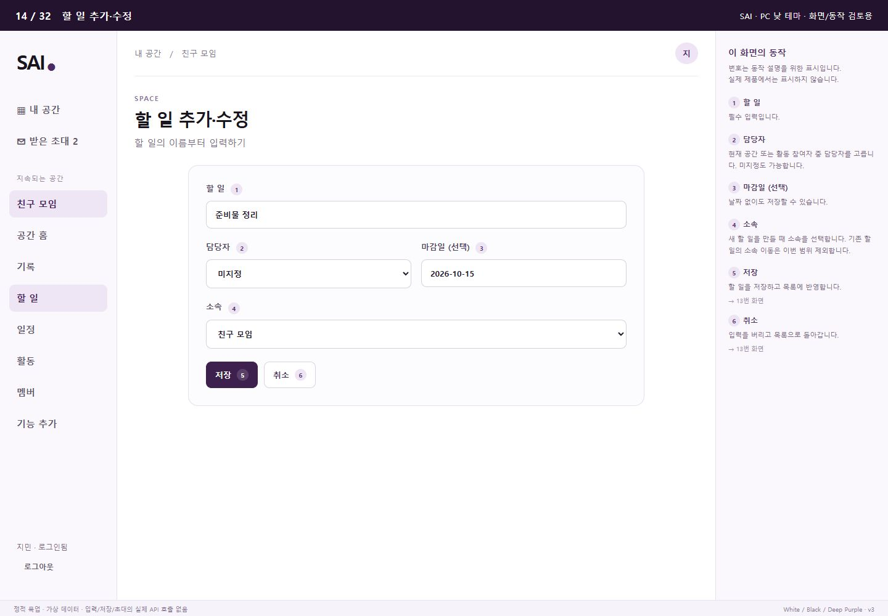

| 번호 | 요소 | 동작·결과 | 이동 |
|---|---|---|---|
| 1 | 할 일 | 필수 입력입니다. | 현재 화면 |
| 2 | 담당자 | 현재 공간 또는 활동 참여자 중 담당자를 고릅니다. 미지정도 가능합니다. | 현재 화면 |
| 3 | 마감일 (선택) | 날짜 없이도 저장할 수 있습니다. | 현재 화면 |
| 4 | 소속 | 새 할 일을 만들 때 소속을 선택합니다. 기존 할 일의 소속 이동은 이번 범위 제외합니다. | 현재 화면 |
| 5 | 저장 | 할 일을 저장하고 목록에 반영합니다. | 13 |
| 6 | 취소 | 입력을 버리고 목록으로 돌아갑니다. | 13 |

**상태·예외:** 로딩 → 성공 또는 오류 안내. 오류가 나면 입력을 유지하고 다시 시도합니다.

### 15. 공간 일정

날짜별 약속을 모아서 보기

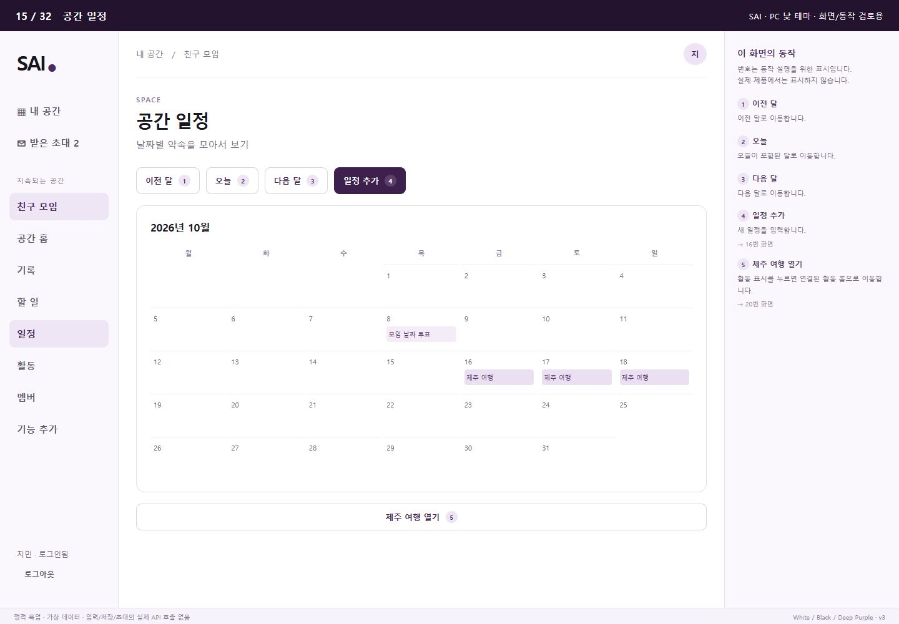

| 번호 | 요소 | 동작·결과 | 이동 |
|---|---|---|---|
| 1 | 이전 달 | 이전 달로 이동합니다. | 현재 화면 |
| 2 | 오늘 | 오늘이 포함된 달로 이동합니다. | 현재 화면 |
| 3 | 다음 달 | 다음 달로 이동합니다. | 현재 화면 |
| 4 | 일정 추가 | 새 일정을 입력합니다. | 16 |
| 5 | 제주 여행 열기 | 활동 표시를 누르면 연결된 활동 홈으로 이동합니다. | 20 |

**상태·예외:** 달력은 월요일 시작. 여행 Event 기간은 연결된 활동으로 표시하고 개별 약속과 구분합니다.

### 16. 일정 추가

약속의 시간과 소속을 명확하게

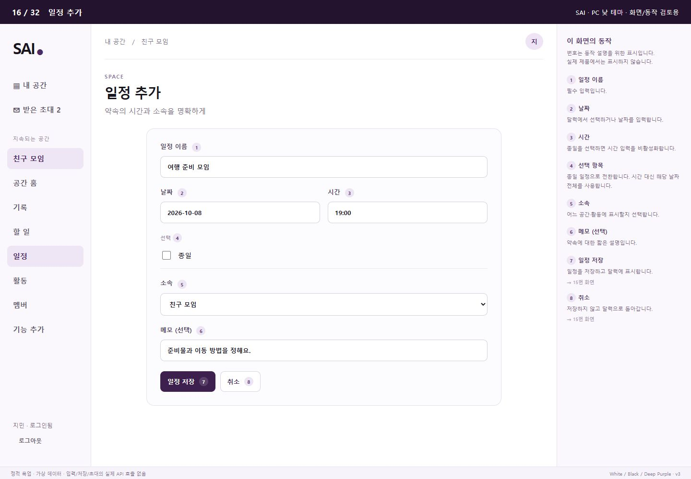

| 번호 | 요소 | 동작·결과 | 이동 |
|---|---|---|---|
| 1 | 일정 이름 | 필수 입력입니다. | 현재 화면 |
| 2 | 날짜 | 달력에서 선택하거나 날짜를 입력합니다. | 현재 화면 |
| 3 | 시간 | 종일을 선택하면 시간 입력을 비활성화합니다. | 현재 화면 |
| 4 | 선택 항목 | 종일 일정으로 전환합니다. 시간 대신 해당 날짜 전체를 사용합니다. | 현재 화면 |
| 5 | 소속 | 어느 공간·활동에 표시할지 선택합니다. | 현재 화면 |
| 6 | 메모 (선택) | 약속에 대한 짧은 설명입니다. | 현재 화면 |
| 7 | 일정 저장 | 일정을 저장하고 달력에 표시합니다. | 15 |
| 8 | 취소 | 저장하지 않고 달력으로 돌아갑니다. | 15 |

**상태·예외:** 유효하지 않은 날짜·시간은 해당 입력란에 안내합니다. 시간대는 현재 서비스의 기준을 명시하고 여행 국가 확장은 별도 설계합니다.

### 17. 활동 목록

계속 쓰는 공간 안에서 특정 활동 찾아가기

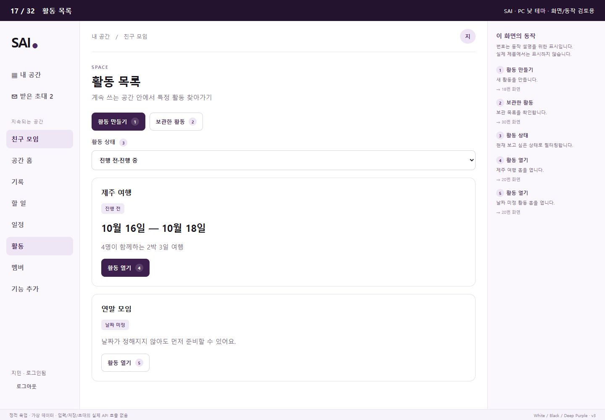

| 번호 | 요소 | 동작·결과 | 이동 |
|---|---|---|---|
| 1 | 활동 만들기 | 새 활동을 만듭니다. | 18 |
| 2 | 보관한 활동 | 보관 목록을 확인합니다. | 30 |
| 3 | 활동 상태 | 현재 보고 싶은 상태로 필터링합니다. | 현재 화면 |
| 4 | 활동 열기 | 제주 여행 홈을 엽니다. | 20 |
| 5 | 활동 열기 | 날짜 미정 활동 홈을 엽니다. | 20 |

**상태·예외:** 로딩 → 성공 또는 오류 안내. 오류가 나면 입력을 유지하고 다시 시도합니다.

### 18. 활동 만들기

목적과 제목을 먼저, 날짜는 선택

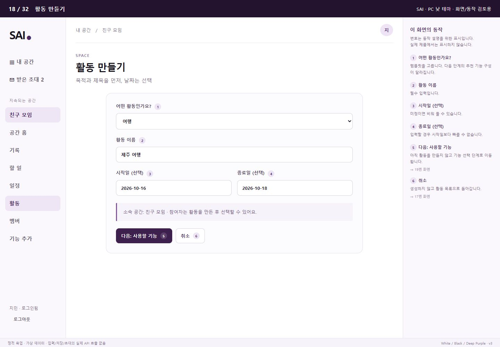

| 번호 | 요소 | 동작·결과 | 이동 |
|---|---|---|---|
| 1 | 어떤 활동인가요? | 템플릿을 고릅니다. 다음 단계의 추천 기능 구성이 달라집니다. | 현재 화면 |
| 2 | 활동 이름 | 필수 입력입니다. | 현재 화면 |
| 3 | 시작일 (선택) | 미정이면 비워 둘 수 있습니다. | 현재 화면 |
| 4 | 종료일 (선택) | 입력할 경우 시작일보다 빠를 수 없습니다. | 현재 화면 |
| 5 | 다음: 사용할 기능 | 아직 활동을 만들지 않고 기능 선택 단계로 이동합니다. | 19 |
| 6 | 취소 | 생성하지 않고 활동 목록으로 돌아갑니다. | 17 |

**상태·예외:** 로딩 → 성공 또는 오류 안내. 오류가 나면 입력을 유지하고 다시 시도합니다.

### 19. 활동에 넣을 기능

추천 구성에서 필요 없는 기능 빼기

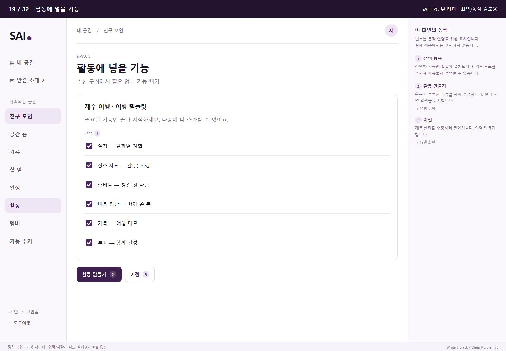

| 번호 | 요소 | 동작·결과 | 이동 |
|---|---|---|---|
| 1 | 선택 항목 | 선택한 기능만 활동에 설치됩니다. 기록·투표를 포함해 자유롭게 선택할 수 있습니다. | 현재 화면 |
| 2 | 활동 만들기 | 활동과 선택한 기능을 함께 생성합니다. 실패하면 입력을 유지합니다. | 20 |
| 3 | 이전 | 제목·날짜를 수정하러 돌아갑니다. 입력은 유지합니다. | 18 |

**상태·예외:** 중복 생성 방지. 실제 구현에서는 활동 생성과 기능 설치의 일관성이 필요합니다.

### 20. 활동 홈

여행에서 지금 필요한 것만 요약하기

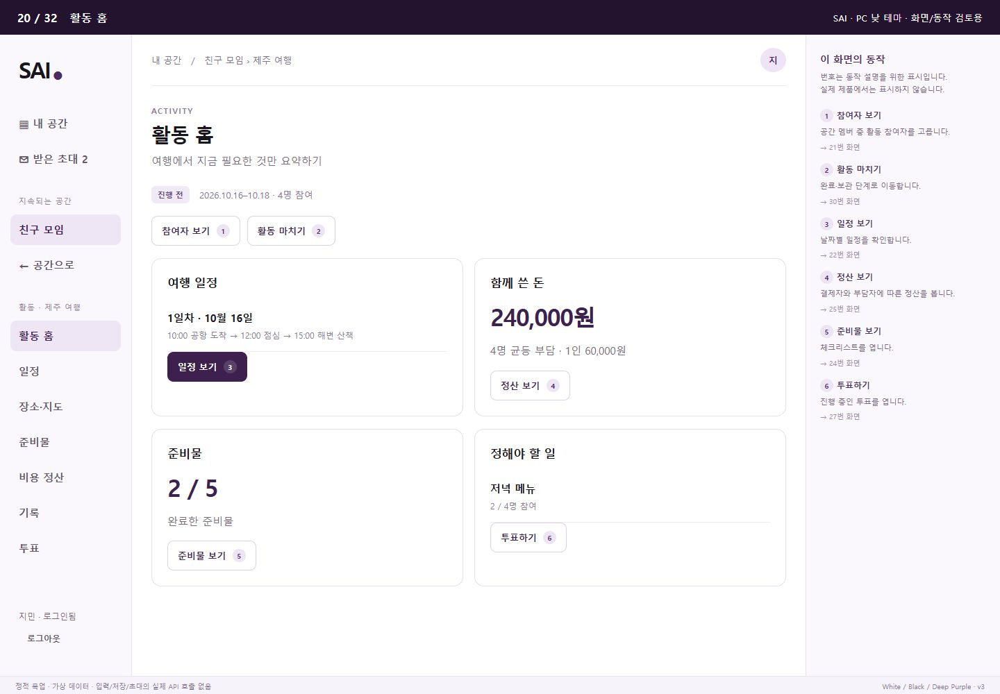

| 번호 | 요소 | 동작·결과 | 이동 |
|---|---|---|---|
| 1 | 참여자 보기 | 공간 멤버 중 활동 참여자를 고릅니다. | 21 |
| 2 | 활동 마치기 | 완료·보관 단계로 이동합니다. | 30 |
| 3 | 일정 보기 | 날짜별 일정을 확인합니다. | 22 |
| 4 | 정산 보기 | 결제자와 부담자에 따른 정산을 봅니다. | 25 |
| 5 | 준비물 보기 | 체크리스트를 엽니다. | 24 |
| 6 | 투표하기 | 진행 중인 투표를 엽니다. | 27 |

**상태·예외:** 로딩 → 성공 또는 오류 안내. 오류가 나면 입력을 유지하고 다시 시도합니다.

### 21. 활동 참여자

공간 멤버 중 함께할 사람 선택하기

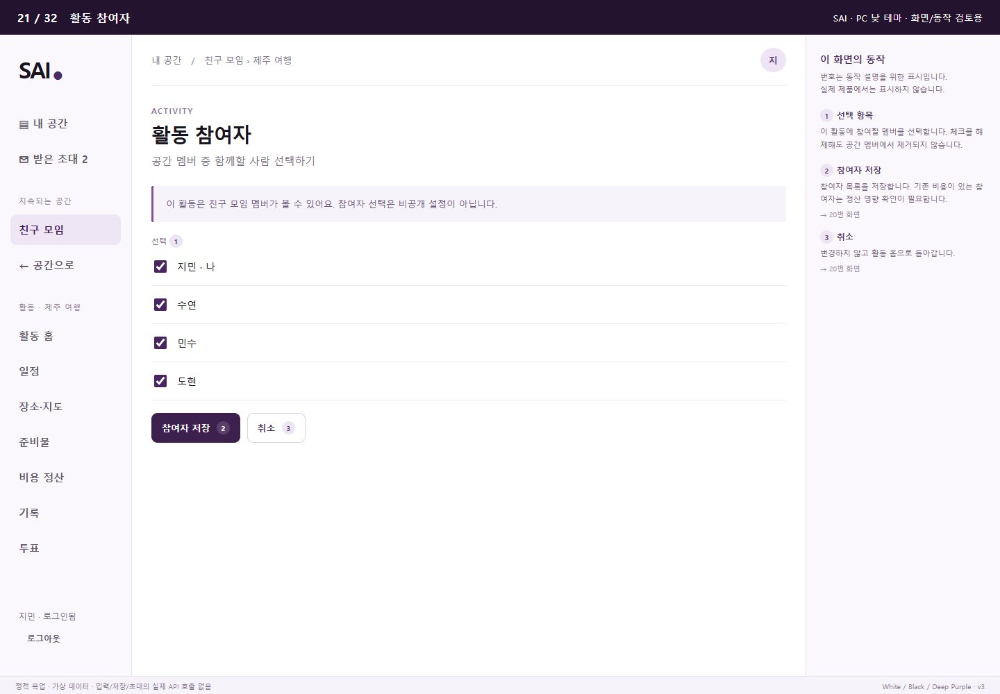

| 번호 | 요소 | 동작·결과 | 이동 |
|---|---|---|---|
| 1 | 선택 항목 | 이 활동에 참여할 멤버를 선택합니다. 체크를 해제해도 공간 멤버에서 제거되지 않습니다. | 현재 화면 |
| 2 | 참여자 저장 | 참여자 목록을 저장합니다. 기존 비용이 있는 참여자는 정산 영향 확인이 필요합니다. | 20 |
| 3 | 취소 | 변경하지 않고 활동 홈으로 돌아갑니다. | 20 |

**상태·예외:** 활동 편집 권한이 없는 사용자는 목록만 봅니다. 비용 기록이 있는 참여자를 자동으로 정산에서 제외하지 않습니다.

### 22. 날짜별 여행 일정

하루 단위로 장소와 시간을 배치하기

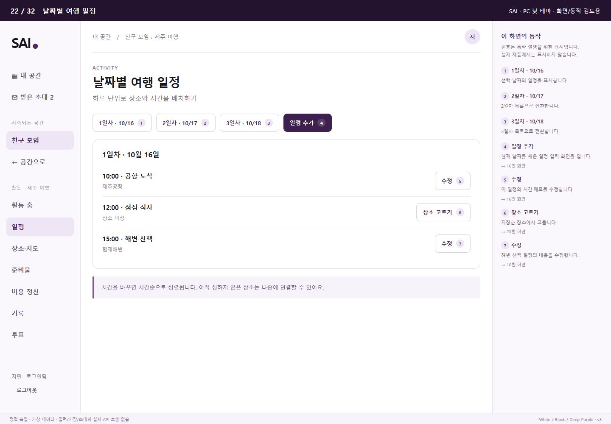

| 번호 | 요소 | 동작·결과 | 이동 |
|---|---|---|---|
| 1 | 1일차 · 10/16 | 선택 날짜의 일정을 표시합니다. | 현재 화면 |
| 2 | 2일차 · 10/17 | 2일차 목록으로 전환합니다. | 현재 화면 |
| 3 | 3일차 · 10/18 | 3일차 목록으로 전환합니다. | 현재 화면 |
| 4 | 일정 추가 | 현재 날짜를 채운 일정 입력 화면을 엽니다. | 16 |
| 5 | 수정 | 이 일정의 시간·메모를 수정합니다. | 16 |
| 6 | 장소 고르기 | 저장한 장소에서 고릅니다. | 23 |
| 7 | 수정 | 해변 산책 일정의 내용을 수정합니다. | 16 |

**상태·예외:** 로딩 → 성공 또는 오류 안내. 오류가 나면 입력을 유지하고 다시 시도합니다.

### 23. 장소·지도

장소 검색과 저장 목록을 함께 보기

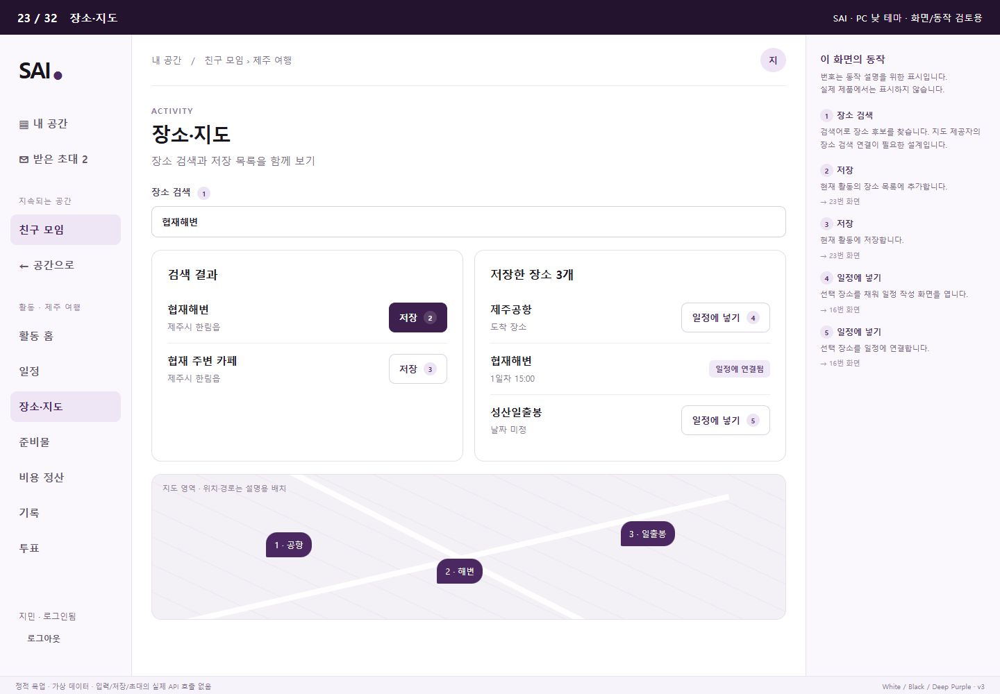

| 번호 | 요소 | 동작·결과 | 이동 |
|---|---|---|---|
| 1 | 장소 검색 | 검색어로 장소 후보를 찾습니다. 지도 제공자의 장소 검색 연결이 필요한 설계입니다. | 현재 화면 |
| 2 | 저장 | 현재 활동의 장소 목록에 추가합니다. | 23 |
| 3 | 저장 | 현재 활동에 저장합니다. | 23 |
| 4 | 일정에 넣기 | 선택 장소를 채워 일정 작성 화면을 엽니다. | 16 |
| 5 | 일정에 넣기 | 선택 장소를 일정에 연결합니다. | 16 |

**상태·예외:** 검색 중 / 결과 없음 / 이미 저장함 / 지도 로딩 실패. 지도 실패해도 저장한 장소 목록은 접근할 수 있게 합니다.

### 24. 준비물

체크 여부와 누가 챙기는지 확인하기

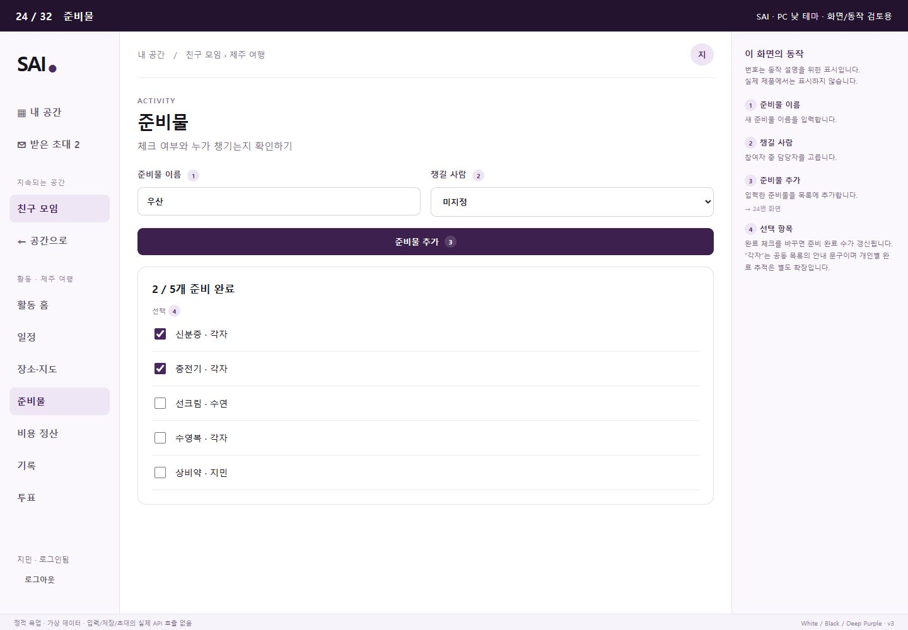

| 번호 | 요소 | 동작·결과 | 이동 |
|---|---|---|---|
| 1 | 준비물 이름 | 새 준비물 이름을 입력합니다. | 현재 화면 |
| 2 | 챙길 사람 | 참여자 중 담당자를 고릅니다. | 현재 화면 |
| 3 | 준비물 추가 | 입력한 준비물을 목록에 추가합니다. | 24 |
| 4 | 선택 항목 | 완료 체크를 바꾸면 준비 완료 수가 갱신됩니다. “각자”는 공동 목록의 안내 문구이며 개인별 완료 추적은 별도 확장입니다. | 현재 화면 |

**상태·예외:** 로딩 → 성공 또는 오류 안내. 오류가 나면 입력을 유지하고 다시 시도합니다.

### 25. 비용 정산

결제한 돈과 부담할 돈을 구분하기

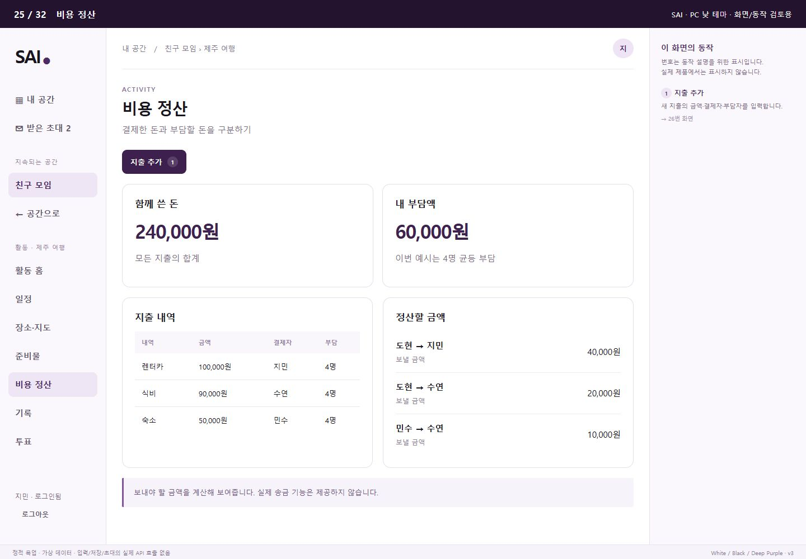

| 번호 | 요소 | 동작·결과 | 이동 |
|---|---|---|---|
| 1 | 지출 추가 | 새 지출의 금액·결제자·부담자를 입력합니다. | 26 |

**상태·예외:** 지출 없음 / 금액 오류 / 참여자 변경. 샘플 순잔액: 지민 +40,000, 수연 +30,000, 민수 -10,000, 도현 -60,000.

### 26. 지출 추가

누가 결제했고 누가 나눠 낼지 입력하기

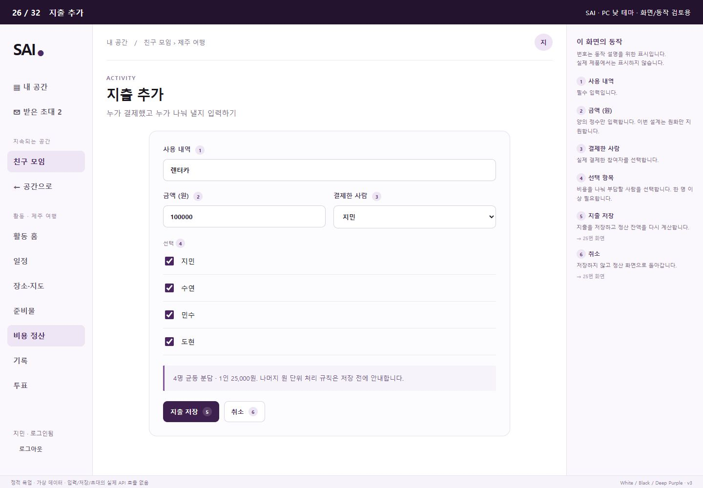

| 번호 | 요소 | 동작·결과 | 이동 |
|---|---|---|---|
| 1 | 사용 내역 | 필수 입력입니다. | 현재 화면 |
| 2 | 금액 (원) | 양의 정수만 입력합니다. 이번 설계는 원화만 지원합니다. | 현재 화면 |
| 3 | 결제한 사람 | 실제 결제한 참여자를 선택합니다. | 현재 화면 |
| 4 | 선택 항목 | 비용을 나눠 부담할 사람을 선택합니다. 한 명 이상 필요합니다. | 현재 화면 |
| 5 | 지출 저장 | 지출을 저장하고 정산 잔액을 다시 계산합니다. | 25 |
| 6 | 취소 | 저장하지 않고 정산 화면으로 돌아갑니다. | 25 |

**상태·예외:** 다중 통화·불균등 분담·송금 연동은 제외. 원 단위 나머지는 참여자 고정 순서로 1원씩 배분하도록 설계 검증 필요.

### 27. 투표 참여·결과

한 가지를 선택하고 결과 확인하기

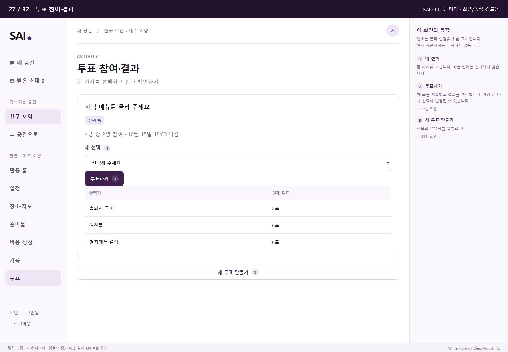

| 번호 | 요소 | 동작·결과 | 이동 |
|---|---|---|---|
| 1 | 내 선택 | 한 가지를 고릅니다. 제출 전에는 집계되지 않습니다. | 현재 화면 |
| 2 | 투표하기 | 한 표를 제출하고 결과를 갱신합니다. 마감 전 다시 선택해 변경할 수 있습니다. | 27 |
| 3 | 새 투표 만들기 | 제목과 선택지를 입력합니다. | 28 |

**상태·예외:** 진행 중 / 참여 완료 / 마감됨. 마감 이후에는 제출·변경이 불가능하고 결과만 표시합니다.

### 28. 투표 만들기

제목과 선택지만으로 함께 결정하기

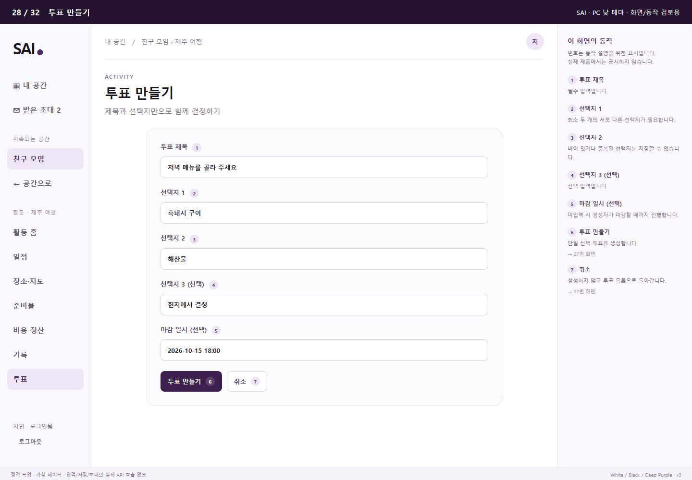

| 번호 | 요소 | 동작·결과 | 이동 |
|---|---|---|---|
| 1 | 투표 제목 | 필수 입력입니다. | 현재 화면 |
| 2 | 선택지 1 | 최소 두 개의 서로 다른 선택지가 필요합니다. | 현재 화면 |
| 3 | 선택지 2 | 비어 있거나 중복된 선택지는 저장할 수 없습니다. | 현재 화면 |
| 4 | 선택지 3 (선택) | 선택 입력입니다. | 현재 화면 |
| 5 | 마감 일시 (선택) | 미입력 시 생성자가 마감할 때까지 진행합니다. | 현재 화면 |
| 6 | 투표 만들기 | 단일 선택 투표를 생성합니다. | 27 |
| 7 | 취소 | 생성하지 않고 투표 목록으로 돌아갑니다. | 27 |

**상태·예외:** 익명·복수 선택·가중치 투표는 제외. 생성자가 수동 마감하는 동작은 결과 화면에서 권한에 따라 표시합니다.

### 29. 저장 실패·이동 확인

오류가 나도 입력 내용 지키기

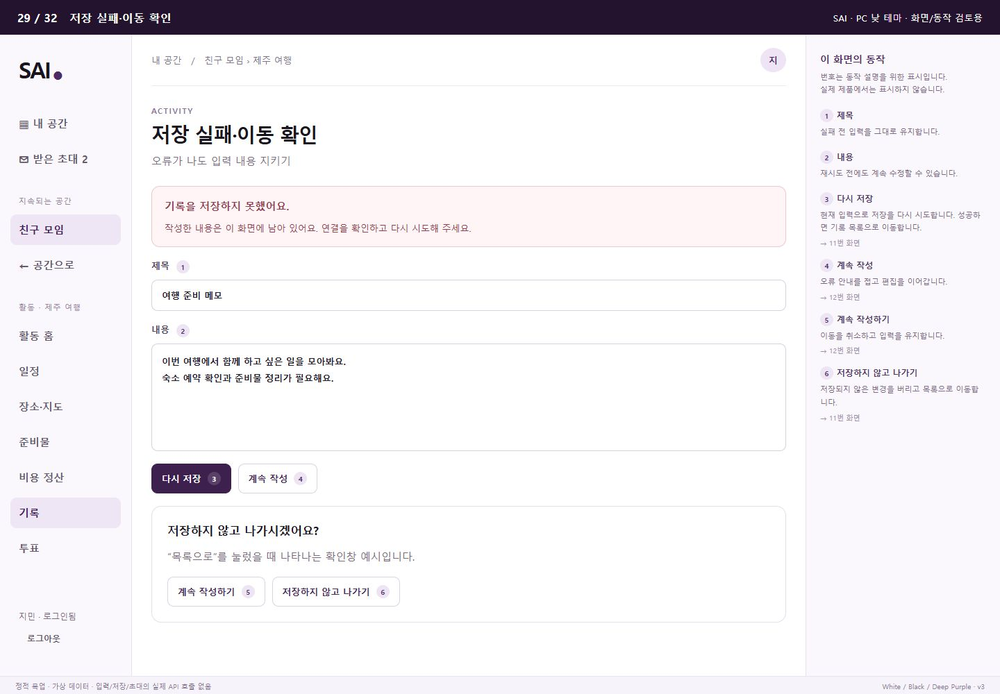

| 번호 | 요소 | 동작·결과 | 이동 |
|---|---|---|---|
| 1 | 제목 | 실패 전 입력을 그대로 유지합니다. | 현재 화면 |
| 2 | 내용 | 재시도 전에도 계속 수정할 수 있습니다. | 현재 화면 |
| 3 | 다시 저장 | 현재 입력으로 저장을 다시 시도합니다. 성공하면 기록 목록으로 이동합니다. | 11 |
| 4 | 계속 작성 | 오류 안내를 접고 편집을 이어갑니다. | 12 |
| 5 | 계속 작성하기 | 이동을 취소하고 입력을 유지합니다. | 12 |
| 6 | 저장하지 않고 나가기 | 저장되지 않은 변경을 버리고 목록으로 이동합니다. | 11 |

**상태·예외:** 상단은 저장 실패, 하단은 이동 확인 상태를 함께 설명한 검토 화면입니다. 실제 UI에서는 해당 상황의 안내만 표시합니다.

### 30. 활동 완료·보관

활동이 끝나도 기록은 남기기

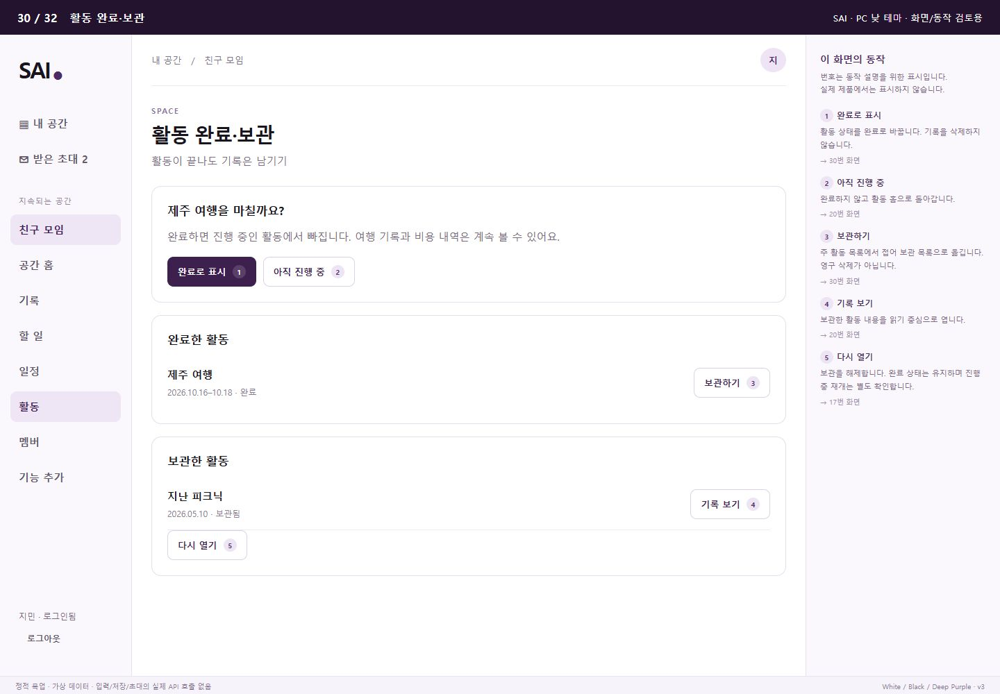

| 번호 | 요소 | 동작·결과 | 이동 |
|---|---|---|---|
| 1 | 완료로 표시 | 활동 상태를 완료로 바꿉니다. 기록을 삭제하지 않습니다. | 30 |
| 2 | 아직 진행 중 | 완료하지 않고 활동 홈으로 돌아갑니다. | 20 |
| 3 | 보관하기 | 주 활동 목록에서 접어 보관 목록으로 옮깁니다. 영구 삭제가 아닙니다. | 30 |
| 4 | 기록 보기 | 보관한 활동 내용을 읽기 중심으로 엽니다. | 20 |
| 5 | 다시 열기 | 보관을 해제합니다. 완료 상태는 유지하며 진행 중 재개는 별도 확인합니다. | 17 |

**상태·예외:** 완료 전 / 완료 후 / 보관 후의 세 상태를 한 장에서 비교합니다. 실제 화면에서는 해당 상태에 맞는 조작만 표시합니다.

### 31. AI 기능 추천 · 향후 예시

추천 근거를 확인하고 직접 선택하기

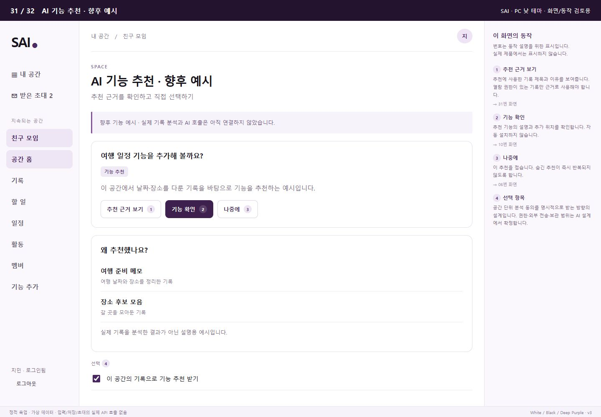

| 번호 | 요소 | 동작·결과 | 이동 |
|---|---|---|---|
| 1 | 추천 근거 보기 | 추천에 사용한 기록 제목과 이유를 보여줍니다. 열람 권한이 있는 기록만 근거로 사용해야 합니다. | 31 |
| 2 | 기능 확인 | 추천 기능의 설명과 추가 위치를 확인합니다. 자동 설치하지 않습니다. | 10 |
| 3 | 나중에 | 이 추천을 접습니다. 숨긴 추천이 즉시 반복되지 않도록 합니다. | 06 |
| 4 | 선택 항목 | 공간 단위 분석 동의를 명시적으로 받는 방향의 설계입니다. 권한·외부 전송·보관 범위는 AI 설계에서 확정합니다. | 현재 화면 |

**상태·예외:** 향후: 동의 전 / 분석 중 / 근거 부족 / 추천 있음 / 숨김 / 실패. 비용·응답시간·권한 누출·추천 정확도 실험 계획을 별도 승인받습니다.

### 32. 공동 편집 · 향후 예시

함께 보고 수정하는 상태를 구분하기

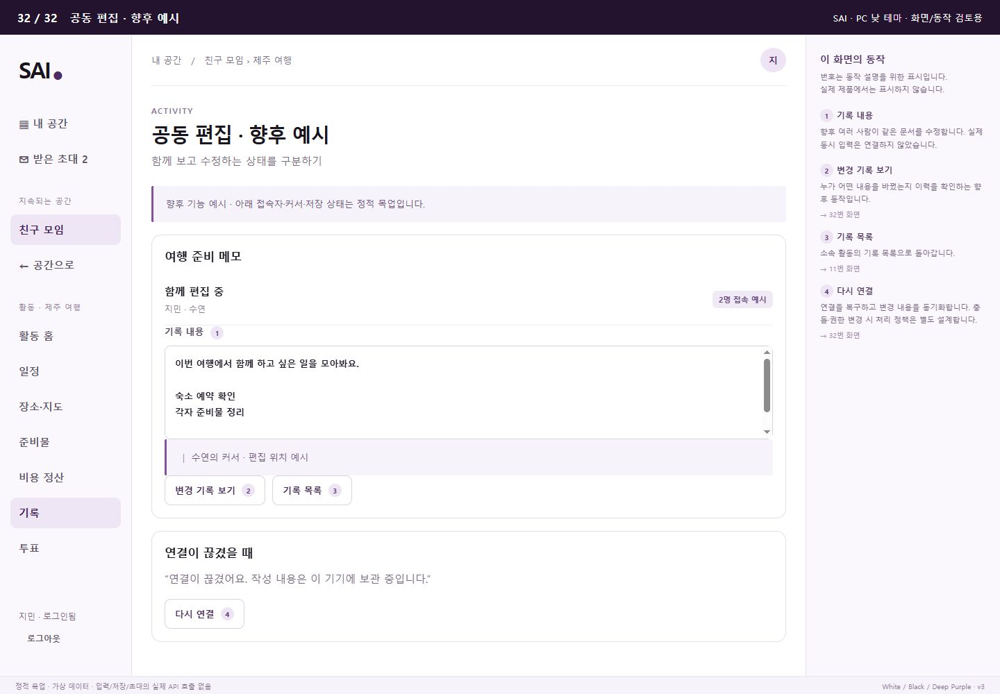

| 번호 | 요소 | 동작·결과 | 이동 |
|---|---|---|---|
| 1 | 기록 내용 | 향후 여러 사람이 같은 문서를 수정합니다. 실제 동시 입력은 연결하지 않았습니다. | 현재 화면 |
| 2 | 변경 기록 보기 | 누가 어떤 내용을 바꿨는지 이력을 확인하는 향후 동작입니다. | 32 |
| 3 | 기록 목록 | 소속 활동의 기록 목록으로 돌아갑니다. | 11 |
| 4 | 다시 연결 | 연결을 복구하고 변경 내용을 동기화합니다. 충돌·권한 변경 시 처리 정책은 별도 설계합니다. | 32 |

**상태·예외:** 향후: 연결 중 / 동기화 완료 / 오프라인 / 재연결 / 권한 회수. 기본 버전의 수동 저장과 구분하며 협업 도입 시 저장 경험을 다시 승인받습니다.

## 구현 전 확인할 범위

이 자료는 화면·동작 설계입니다. 버튼 링크는 관련 화면을 보여주는 검토용 이동이며 실제 저장·초대·계산 실행이 아닙니다. 역할·참여자·정산 규칙과 지도 서비스는 해당 백엔드 설계를 제시하고 승인받아 구현합니다. 현재 API는 숫자 사용자 ID를 받습니다. 직관적인 초대를 위해 로그인 아이디로 사용자 이름을 확인하는 조회 단계가 필요하며, 이 연결은 아직 구현하지 않은 설계입니다.

## 검증 계획

1. PC 1440px 기준 모든 화면의 주요 입력과 안내가 잘리지 않는지 확인.
2. 공간·활동 간 콘텐츠 소속과 메뉴 범위 일치 확인.
3. 각 입력의 필수값·실패·중복 제출·미저장 이동 상태 검증.
4. 초대 수락·거절 결과와 역할별 접근을 실제 API 연결 후 검사.
5. 정산 총액, 개인 부담액, 순잔액 및 1원 나머지 처리 검증.
6. 일반 글자 대비 4.5:1, 키보드 조작과 초점 확인.
7. PNG와 실제 구현 캡처의 차이를 승인 후 보고.

## 파일 구성

- png/01.png … png/32.png: 개별 화면
- index.html: 전체 목록과 화면 이동 검토 페이지
- screens.json: 화면 및 동작 정의
- source/build_mockups.py: 목업 전용 렌더링 원본
- interaction-guide.md: 이 문서
- SAI-PC-Light-32-PNG.zip: PNG와 문서 묶음

제작: HTML/CSS로 화면을 정의한 뒤 브라우저에서 캡처한 PNG. 이미지 생성 모델을 사용하지 않아 한국어 문구·번호·상태를 일관되게 관리합니다.