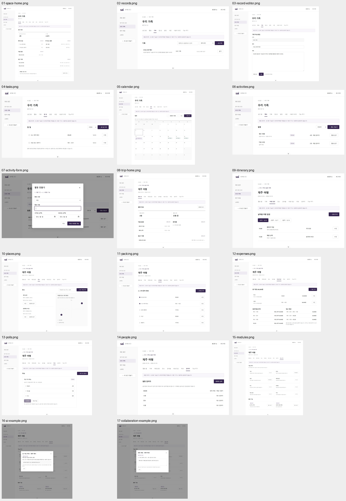

# 실제 구현 화면과 검증

2026-10-05. 승인한 시안의 세부 기능을 Vue 프론트엔드에 반영했다. 아래 PNG는 실제 제품 화면이다. 인증·공간 정보는 로컬 검증용 모의 API이며 세부 콘텐츠는 브라우저 저장소의 체험 데이터다.

## 실제 화면 17장

| PNG | 동작 |
| --- | --- |
| [01 공간 홈](actual/01-space-home.png) | 공간 정보, 할 일·활동·일정·최근 기록 요약 |
| [02 기록 목록](actual/02-records.png) | 제목·내용 검색, 범위 필터, 새 기록 |
| [03 기록 편집](actual/03-record-editor.png) | 제목·본문 수동 저장, 미저장 이동 확인 |
| [04 할 일](actual/04-tasks.png) | 추가·수정·완료, 담당자·마감일·상태 필터 |
| [05 달력](actual/05-calendar.png) | 월 이동·오늘, 종일·시간 약속, 활동 기간 |
| [06 활동 목록](actual/06-activities.png) | 진행·완료·보관 필터와 활동 진입 |
| [07 활동 생성](actual/07-activity-form.png) | 이름·유형·선택 기간 입력 후 기능 선택 |
| [08 여행 홈](actual/08-trip-home.png) | 활동 상태·일정·준비물·기록 요약 |
| [09 여행 일정](actual/09-itinerary.png) | 날짜별 일정과 저장 장소 연결 |
| [10 장소](actual/10-places.png) | 이름·주소·선택 좌표 입력·검색·수정 |
| [11 준비물](actual/11-packing.png) | 추가·수정·담당자·체크·집계 |
| [12 비용 정산](actual/12-expenses.png) | 지출·지불자·수혜자, 잔액과 정산 제안 |
| [13 투표](actual/13-polls.png) | 생성·선택 변경·결과·마감 |
| [14 참여자](actual/14-people.png) | 실제 계정과 예시 인물 구분, 활동 참여자 변경 |
| [15 기능 추가](actual/15-modules.png) | 현재 공간/활동에만 기능 설치 |
| [16 AI 예시](actual/16-ai-example.png) | 향후 기능 설명. 실제 AI 분석 없음 |
| [17 공동 편집 예시](actual/17-collaboration-example.png) | 향후 기능 설명. 실제 동시 편집 없음 |

[PNG와 설명 묶음](SAI-local-features-implemented.zip). 전체 페이지 캡처의 크기는 [메타데이터](actual/verification.json)에 기록했다.

## 검사 결과

- 타입 검사·프로덕션 빌드 통과.
- 단위 검사 14개 통과: 정산 총액 보존·잔여 원 배분, 날짜·한국 시간 마감·0도 좌표, 계정/공간별 저장 분리, 저장 실패·손상 데이터 처리.
- Chromium 화면 검사 19개 통과: 기존 인증·공간·초대 7개와 세부 기능 12개. 기록 작성·수정·검색·새로고침·미저장 확인, 할 일·달력·활동 보관·장소·준비물·정산·투표·모듈 설치를 검증했다.
- 변경한 화면·기능·검사 파일의 ESLint 검사 통과.
- 실제 DB와 백엔드 통합 검사는 이번 작업에서 실행하지 않았다.

## 시안과 실제 반영

승인한 기능 흐름을 유지했다. 실제 제품의 계정·공간 정보와 체험 콘텐츠를 구분하는 안내를 넣었다. 입력에는 공통 창을 사용하며 보관 활동은 읽기 전용이다. AI와 공동 편집은 설치 기능 대신 향후 예시 창이다. 좌표 안내는 실제 지도 화면이 아니며 정산은 송금이 아니다.

기기·사용자·탭 간 동기화와 자동 서버 이관은 아직 없다. [백엔드 연결 준비 문서](../../architecture/frontend-local-content.md)에 저장소 경계와 남은 계약을 정리했다.
